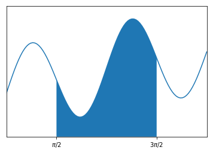

# Definite Integrals

The [definite integral](https://en.wikipedia.org/wiki/Integral) of a function $f(x)$ over an interval $[a,b]$ is the limit

$$
\int_a^b f(x) \, dx = \lim_{N \to \infty} \sum_{i=1}^N f(x_i^ * ) (x_i - x_{i-1}) \ \ , \ x_i^* \in [x_{i-1},x_i]
$$

where, for each $N$,

$$
x_0 = a < x_1 < \cdots < x_N = b
$$

is a partition of $[a,b]$ with $N$ subintervals and the values $x_i^ * \in [x_{i-1},x_i]$ chosen in each subinterval is arbitrary.

The formula in the definition is not very intuitive and almost impossible to use in practice but the basic idea is simple:

$$
\int_a^b f(x) \, dx = \text{(net) area under the curve } y = f(x) \text{ on } [a,b]
$$

The value of the definite integral represents the (net) area under the curve of the graph of $y=f(x)$ on the interval $[a,b]$. The term "net" means that area above the $x$-axis is positive and the area under the $x$-axis counts as negative area. For example, we can visualize the integral:

$$
\int_{\pi/2}^{3\pi/2} \left( \sin(0.2 x) + \sin(2x) + 1 \right) dx
$$


```python
import numpy as np
import matplotlib.pyplot as plt
%matplotlib inline

f = lambda x: np.sin(0.2*x) + np.sin(2*x) + 1

x = np.linspace(0,2*np.pi,100)
y = f(x)
plt.plot(x,y)

X = np.linspace(np.pi/2,3*np.pi/2,100)
Y = f(X)
plt.fill_between(X,Y)

plt.xticks([np.pi/2,3*np.pi/2],['$\pi/2$','$3\pi/2$']); plt.yticks([]);
plt.xlim([0,2*np.pi]); plt.ylim([0,3]);
plt.show()
```





In our introductory calculus courses, we focus on integrals which we can solve exactly by the [Fundamental Theorem of Calculus](https://en.wikipedia.org/wiki/Fundamental_theorem_of_calculus) such as

$$
\int_0^{\pi/2} \cos(x) \, dx = \sin(\pi/2) - \sin(0) = 1
$$

However, most definite integrals are impossible to solve exactly. For example, the famous [error function](https://en.wikipedia.org/wiki/Error_function) in probability

$$
\mathrm{erf}(x) = \frac{2}{\sqrt{\pi}} \int_0^x e^{-t^2} dt
$$

is a definite integral for which there is no explicit formula.

The idea behind [numerical integration](https://en.wikipedia.org/wiki/Numerical_integration) is to use simple geometric shapes to approximate the area under the curve $y=f(x)$ to estimate definite integrals. In this section, we explore the simplest methods of numerical integration: Riemann sums, the trapezoid rule and Simpson's rule.
