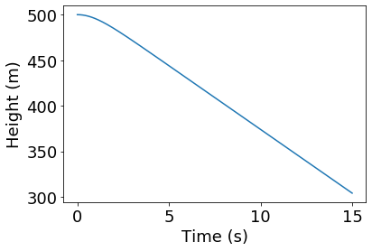
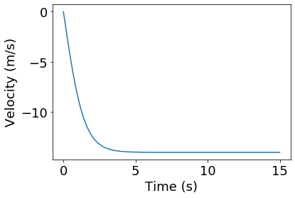

## Hailstone


## Setup

Loading useful libraries, and defining constants.


```python
from matplotlib import pyplot as plt
import numpy as np

ti = 0
tf = 15.0                       # Use 15.0, not 15 to tell Python what kind of variable to use for the time
NumPts = 1000
dt = (tf - ti)/NumPts           # Time step

xi = 500                        # Starting height
vi = 0                          # Starting velocity
gg = -9.8                       # Gravitational acceleration
eta = 3*10**-5
mass = 6*10**-4
```

## Loop


```python
time = np.linspace(ti,tf,NumPts)
xx = [xi]                       # Begin a list which will contain the values of position from ti to tf
vv = [vi]                       # Begin a list which will contain the values of velocity from ti to tf

for i in range(NumPts - 1):
    # Change the following lines to treat a problem with different forces, e.g., add a spring force Fspr = -k*xx[i]
    Fdrag = eta*vv[i]**2        # Drag force is proportional to velocity squared
    Fgrav = mass*gg             # Gravitational force
    acc = (Fdrag + Fgrav)/mass  # Acceleration is net force divided by mass
    
    # The next lines can be used without alteration for any type of force
    dx = vv[i]*dt               # Calculate how far the object moves in the short time interval between time[i] and time [i+1]
    newx = xx[i] + dx           # Find the new position by adding dx to the present position
    dv = acc*dt                 # Calculate how much the velocity changes between time[i] and time [i+1]
    newv = vv[i] + dv           # Find the new velocity by adding dv to the present velocity
    xx.append(newx)             # Add the next position to the list of position values
    vv.append(newv)             # Add the next velocity to the list of velocity values

```

## Plotting


```python

plt.rcParams.update({'font.size': 18})
xfig = plt.figure()
plt.plot(time,xx)
plt.xlabel('Time (s)')
plt.ylabel('Height (m)')
#xfig.savefig('HailStoneHeight.jpg')

vfig = plt.figure()
plt.plot(time,vv)
plt.xlabel('Time (s)')
plt.ylabel('Velocity (m/s)')
#vfig.savefig('HailStoneVelocity.jpg')

```


    Text(0, 0.5, 'Velocity (m/s)')








_Download this page [as a Jupyter notebook](https://github.com/vuw-scps/python-physics/raw/master/notebooks/phys114/HailStone.ipynb) or as a [standalone Python script](https://github.com/vuw-scps/python-physics/raw/master/scripts/phys114/HailStone.py)._
