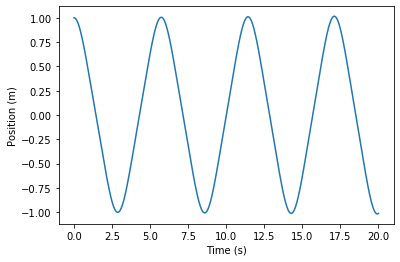
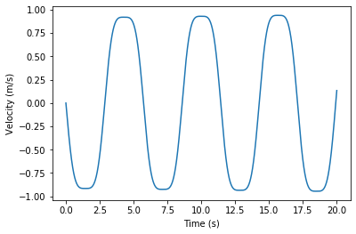

## NIIsolver


## Setup

Loading libraries.


```python
from matplotlib import pyplot as plt
import numpy as np

ti = 0
tf = 20.0                       # Use 15.0, not 15 to tell Python what kind of variable to use for the time
NumPts = 10001
time = np.linspace(ti,tf,NumPts) 

dt = (tf - ti)/NumPts           # Time step

xi = 1                        # Starting height
vi = 0                          # Starting velocity
k = 5
mass = 3

```

## Loop

We'll calculate the potential on a $N_x\times N_y$ grid of $(x,y)$ values.


```python

xx = [xi]                       # Begin a list which will contain the values of position from ti to tf
vv = [vi]                       # Begin a list which will contain the values of velocity from ti to tf

for i in range(NumPts - 1):
    Force = -k*xx[i]**3
    acc = Force/mass
    
    dx = vv[i]*dt               # Calculate how far the object moves in the short time interval between time[i] and time [i+1]
    newx = xx[i] + dx           # Find the new position by adding dx to the present position
    xx.append(newx)             # Add the next position to the list of position values
    dv = acc*dt
    newv = vv[i] + dv
    vv.append(newv)


```

## Plot

The following lines will plot the calculated position and velocity as functions of time


```python
xfig = plt.figure()
plt.plot(time,xx)
plt.xlabel('Time (s)')
plt.ylabel('Position (m)')
#xfig.savefig('StrangeRestoringForce.jpg')

vfig = plt.figure()
plt.plot(time,vv)
plt.xlabel('Time (s)')
plt.ylabel('Velocity (m/s)')

```


    Text(0, 0.5, 'Velocity (m/s)')








_Download this page [as a Jupyter notebook](https://github.com/vuw-scps/python-physics/raw/master/notebooks/phys114/NIIsolver.ipynb) or as a [standalone Python script](https://github.com/vuw-scps/python-physics/raw/master/scripts/phys114/NIIsolver.py)._
