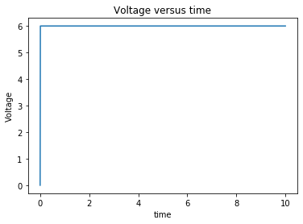

## Inductor/Capacitor


## Setup

Loading libraries.


```python
import numpy as np
from matplotlib import pyplot as plt

```

## Calculation


```python
L=0.001
Vo=6
R=100

T=L/R

t=np.linspace(0,10,1000)
I=(Vo/R)*(1-np.e**(-t/T))
V=I*R
```

## Plot

The following lines will plot the calculated position and velocity as functions of time


```python

fig1 = plt.figure()
plt.title ('Voltage versus time')
plt.plot(t,V)
plt.xlabel('time')
plt.ylabel('Voltage')
# fig1.savefig('graph.jpg')
```


    Text(0, 0.5, 'Voltage')





_Download this page [as a Jupyter notebook](https://github.com/vuw-scps/python-physics/raw/master/notebooks/phys115/Inductor-Capacitor.ipynb) or as a [standalone Python script](https://github.com/vuw-scps/python-physics/raw/master/scripts/phys115/Inductor-Capacitor.py)._
