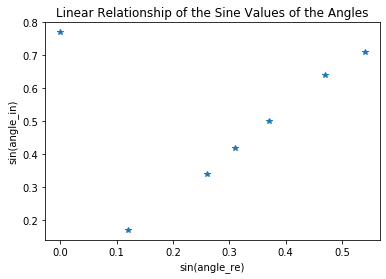

## Refraction


```python
import numpy as np
from matplotlib import pyplot as plt
from scipy.stats import linregress

```

## Calculation

Code to calculate trajectory of an object undergoing constant acceleration


```python

ni=1.00                 #input index of refraction of air
angle_in = 60           #input angle of incidence
angle_re = 40           #input angle of refraction

##### EXPERIMENTAL DATA PLUG-IN

angle_in1 = 10
angle_re1 = 7           # input refraction angle 1

angle_in2 = 20
angle_re2 = 15          # input refraction angle 2

angle_in3 = 25
angle_re3 = 18          # input refraction angle 3

angle_in4 = 30
angle_re4 = 22          # input refraction angle 4

angle_in5 = 40
angle_re5 = 28          # input refraction angle 5

angle_in6 = 45
angle_re6 = 33          # input refraction angle 6

angle_in7 = 50        
angle_re7 = 0           # input refraction angle 7

################### CODE FOR CALCULATION OF VALUES AND GRAPHS  ###########
print(" ")

y1=round(np.sin(angle_in1*np.pi/180),2)
y2=round(np.sin(angle_in2*np.pi/180),2)
y3=round(np.sin(angle_in3*np.pi/180),2)
y4=round(np.sin(angle_in4*np.pi/180),2)
y5=round(np.sin(angle_in5*np.pi/180),2)
y6=round(np.sin(angle_in6*np.pi/180),2)
y7=round(np.sin(angle_in7*np.pi/180),2)

x1=round(np.sin(angle_re1*np.pi/180),2)
x2=round(np.sin(angle_re2*np.pi/180),2)
x3=round(np.sin(angle_re3*np.pi/180),2)
x4=round(np.sin(angle_re4*np.pi/180),2)
x5=round(np.sin(angle_re5*np.pi/180),2)
x6=round(np.sin(angle_re6*np.pi/180),2)
x7=round(np.sin(angle_re7*np.pi/180),2)

x=[x1,x2,x3,x4,x5,x6,x7]
y=[y1,y2,y3,y4,y5,y6,y7]

```

     


## Plot the results


```python

fig1 = plt.figure()
plt.title ('Linear Relationship of the Sine Values of the Angles')
plt.plot(x,y,"*")
plt.xlabel('sin(angle_re)')
plt.ylabel('sin(angle_in)')
#fig1.savefig('graph.jpg')


```


    Text(0, 0.5, 'sin(angle_in)')





```python

#calculate index of refraction
slope, intercept, r_value, p_value, stderr = linregress([x1,x2,x3,x4],[y1,y2,y3,y4])
#calculate critical angle angle_cr
angle_cr=round((180/np.pi)*(np.arcsin(1/slope)),0)

print(" ")
print ("Index of refraction   :"," ",round(slope,2))
print(" ")
print("critical angle        :"," ",angle_cr,"degrees")


```

     
    Index of refraction   :   1.32
     
    critical angle        :   49.0 degrees


_Download this page [as a Jupyter notebook](https://github.com/vuw-scps/python-physics/raw/master/notebooks/phys115/Refraction.ipynb) or as a [standalone Python script](https://github.com/vuw-scps/python-physics/raw/master/scripts/phys115/Refraction.py)._
