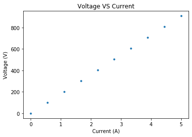

## Resistors


## Setup

Loading useful libraries, and defining constants.


```python
from matplotlib import pyplot as plt
import numpy as np


R1=820      #input resistance 1
R2=33.1     #input resistance 2
R3=150      #input resistance 3

#using a factor to define the type of circuit
a=0         # put 1 if using circuit 1, 0 if otherwise
b=0         # put 1 if using circuit 2, 0 if otherwise
c=1         # put 1 if using circuit 3, 0 if otherwise
d=0         # put 1 if using circuit 4, 0 if otherwise


VT=2.5      # input voltage
```

## Calculations


```python

RT1 = a*(R1 + R2 + R3)
RT2 = b*(1/(1/R1 + 1/R2 + 1/R3))
RT3 = c*((1/(1/R1 +1/R2)) + R3)
RT4 = d*(1/ ((1/(R1+R2)) + 1/R3))

#defining conditions for total resistance depending on type of circuit
if a==1:
    RT = RT1
if b==1:
    RT = RT2
if c==1:
    RT = RT3
if d==1:
    RT = RT4

#calculating total current flowing in the circuit 
IT=VT/RT

#CALCULATING I1,V1
if a==1:
    I1 = IT
    V1=I1*R1
        
if b==1:
    V1=VT
    I1 = V1/R1
        
if c==1:
    R12 = 1/(1/R1 + 1/R2)
    V12 = IT*R12
    V1=V12
    I1=V1/R1
    

if d==1:
    R12 = R1 + R2
    I1 = VT/R12
    V1 = I1*R1

#CALCULATING I2,V2
if a==1:
    I2 = IT
    V2=I2*R2
        
if b==1:
    V2=VT
    I2 = V2/R2
        
if c==1:
    R12 = 1/(1/R1 + 1/R2)
    V12 = IT*R12
    V2=V12
    I2=V2/R2

if d==1:
    R12 = R1 + R2
    I2 = VT/R12
    V2 = I2*R2

#CALCULATING I3,V3
if a==1:
    I3 = IT
    V3=I3*R3
        
if b==1:
    V3=VT
    I3 = V3/R3
        
if c==1:
    R12 = 1/(1/R1 + 1/R2)
    V12 = IT*R12
    V3=VT-V12
    I3=V3/R3

if d==1:
    R12 = R1 + R2
    V3 = VT
    I3 = V3/R3
    

print("RT=",RT,"Ohms")
print("VT=",VT,"V")
print("IT=",IT,"A")
print(" ")
print("I1=",I1,"A")
print("I2=",I2,"A")
print("I3=",I3,"A")
print("V1=",V1,"V")
print("V2=",V2,"V")
print("V3=",V3,"V")

```

    RT= 181.8157308639081 Ohms
    VT= 2.5 V
    IT= 0.013750185355915594 A
     
    I1= 0.000533502678795928 A
    I2= 0.013216682677119666 A
    I3= 0.013750185355915594 A
    V1= 0.43747219661266096 V
    V2= 0.43747219661266096 V
    V3= 2.062527803387339 V


## Plotting


```python
I=np.linspace(0,5,10)

if a==1:
    RT = RT1
if b==1:
    RT = RT2
if c==1:
    RT = RT3
if d==1:
    RT = RT4
    
V=I*RT

fig1 = plt.figure()
plt.title('Voltage VS Current')
plt.plot(I,V,".")
plt.xlabel('Current (A)')
plt.ylabel('Voltage (V)')
```


    Text(0, 0.5, 'Voltage (V)')





_Download this page [as a Jupyter notebook](https://github.com/vuw-scps/python-physics/raw/master/notebooks/phys115/Resistors.ipynb) or as a [standalone Python script](https://github.com/vuw-scps/python-physics/raw/master/scripts/phys115/Resistors.py)._
