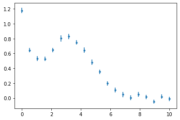
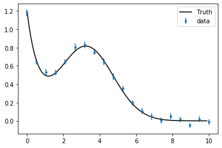
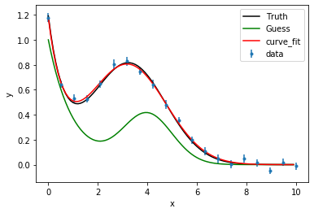

## Nonlinear fitting example

We'll use an artificial dataset to fit a model with 5 parameters, 

$$
y(x) = b_1 \exp\left(-b_2 x\right) + \frac{b_3}{b_5\sqrt{2\pi}} \exp\left(-\tfrac12\frac{(x-b_4)^2}{b_5^2}\right)
$$

It's the sum of a decaying exponential background, and a Gaussian peak.

We first load some standard packages, including `scipy.optimize` and `lmfit` for the nonlinear optimisation.


```python
import os, sys
import numpy as np
from numpy import exp, pi, sqrt

from numpy import linspace
from scipy.optimize import leastsq

import pandas as pd
from matplotlib import pyplot

import scipy.optimize as optimization
# conda install -c conda-forge lmfit
from lmfit import minimize, Parameters 
```

### Loading and displaying the dataset


```python
data = pd.read_csv("exppeak.txt", header=0, delim_whitespace=True)
# note: three ways to refer to a particular column
data.iloc[:,1]
data.loc[:,'x']
data.x
pyplot.errorbar(data.x, data.y, yerr=data.sigma, fmt='.')
```


    <ErrorbarContainer object of 3 artists>





### Defining the model and testing it

We now create a function that computes the predicted values for a given set of parameters $b_1\dots,b_5$:


```python
def model_peak(x, b1, b2, b3, b4, b5):
    return b1*exp(-b2*x) + b3/(b5*sqrt(2*np.pi))*exp(-0.5*(x-b4)**2 / b5**2)
```

We test it by superposing the prediction and the data (in this artificial example, we know the "true" parameters that were used to generate the dataset).


```python
xx = np.arange(0,10,0.1)
truth = model_peak(xx, 1.12, 1.52, 3, 3.26,  1.48)
pyplot.errorbar(data.loc[:,'x'], data.loc[:,'y'], yerr=data.loc[:,'sigma'], fmt='.', label='data')
pyplot.plot(xx, truth, 'k', label='Truth')
pyplot.legend(loc='best')
```


    <matplotlib.legend.Legend at 0x7fc1c856a990>





## Simple nonlinear fitting with `scipy.optimize.curve_fit`

Perhaps the simplest interface for nonlinear fitting is the `curve_fit` function, which takes as arguments the model defined above, the data, and a set of initial guess parameters. The output of the function is the optimised parameters, and the covariance matrix for the fitted parameters:


```python
import scipy.optimize as optimization
p0 = [1, 1, 1, 4,  1]
popt, pcov = optimization.curve_fit(model_peak, data.x, data.y, p0, data.sigma)
popt
```


    array([1.08251862, 1.59378021, 3.11029724, 3.20655998, 1.55177204])


```python
pcov
```


    array([[ 0.00100275, -0.00034778, -0.00109506,  0.00055618, -0.00067476],
           [-0.00034778,  0.01995825,  0.01065553, -0.00575757,  0.00480145],
           [-0.00109506,  0.01065553,  0.00957323, -0.00355233,  0.00408678],
           [ 0.00055618, -0.00575757, -0.00355233,  0.00289486, -0.00165942],
           [-0.00067476,  0.00480145,  0.00408678, -0.00165942,  0.00249512]])


We can visualise the output to confirm that the fit is reasonable.


```python
guess = model_peak(xx, *p0)
fit = model_peak(xx, *popt)
pyplot.errorbar(data.loc[:,'x'], data.loc[:,'y'], yerr=data.loc[:,'sigma'], fmt='.', label='data')
pyplot.plot(xx, truth, 'k-', label='Truth')
pyplot.plot(xx, guess, 'g', label='Guess')
pyplot.plot(xx, fit, 'r', label='curve_fit')
pyplot.legend(loc='best')
pyplot.xlabel("x")
pyplot.ylabel("y")
```


    Text(0, 0.5, 'y')





### More optimisation methods via `lmfit.minimize`

`curve_fit` is simple to use, but not very flexible. We'll try another alternative here, which requires a little more effort in the setup, but provides more options such as different algorithms for the search.


```python
from lmfit import minimize, Parameters, Model, report_fit
from scipy.optimize import leastsq

```

Here we need to provide `minimize` with the normalised residuals (note: they are not squared, as minimize will square them internally for least-square based methods):


```python
def residuals(pars, x, y, eps):
    A1 = pars['A1'].value
    Decay = pars['Decay'].value
    A2 = pars['A2'].value
    Position = pars['Position'].value
    Width = pars['Width'].value

    model = A1*exp(-Decay*x) + A2/(Width*sqrt(2*np.pi))*exp(-0.5*(x-Position)**2 / Width**2)
    
    return (y-model) / eps

```

The rest of the setup consists in creating a `Parameters` object holding the information for all free parameters (at a minimum, their name and initial guess for the value, but one can also set constraints). We can then call the minimize function:


```python
params = Parameters()
params.add('A1', value=1.0)
params.add('Decay', value=1.5)
params.add('A2', value=0.5)
params.add('Position', value=3.0)
params.add('Width', value=1.5)

out = minimize(residuals, params, args=(data.x, data.y, data.sigma), method='leastsq')

print("# Fit using leastsq:")
report_fit(out)
```

    # Fit using leastsq:
    [[Fit Statistics]]
        # fitting method   = leastsq
        # function evals   = 43
        # data points      = 20
        # variables        = 5
        chi-square         = 10.0399205
        reduced chi-square = 0.66932803
        Akaike info crit   = -3.78326151
        Bayesian info crit = 1.19539985
    [[Variables]]
        A1:        1.08251850 +/- 0.03166571 (2.93%) (init = 1)
        Decay:     1.59378187 +/- 0.14126643 (8.86%) (init = 1.5)
        A2:        3.11029830 +/- 0.09784307 (3.15%) (init = 0.5)
        Position:  3.20655937 +/- 0.05380360 (1.68%) (init = 3)
        Width:     1.55177259 +/- 0.04995053 (3.22%) (init = 1.5)
    [[Correlations]] (unreported correlations are < 0.100)
        C(A2, Width)       = 0.836
        C(Decay, A2)       = 0.771
        C(Decay, Position) = -0.757
        C(Decay, Width)    = 0.680
        C(A2, Position)    = -0.675
        C(Position, Width) = -0.617
        C(A1, Width)       = -0.427
        C(A1, A2)          = -0.353
        C(A1, Position)    = 0.326


We can compare the fitted parameters to those obtained via curve_fit:


```python

with np.printoptions(precision=3, suppress=True):
    print("# Fit using curve_fit:")
    print(popt)
```

    # Fit using curve_fit:
    [1.083 1.594 3.11  3.207 1.552]


and their uncertainty, which are estimated by the diagonal components of the covariance matrix:


```python

with np.printoptions(precision=3, suppress=True):
    print("# Uncertainties using curve_fit:")
    print(np.sqrt(np.diag(pcov)))
    
```

    # Uncertainties using curve_fit:
    [0.032 0.141 0.098 0.054 0.05 ]


We could also obtain such undertainty estimates "manually", by evaluating the Hessian matrix at the optimum position in the parameter space:


```python
# conda install -c conda-forge numdifftools 
import numdifftools as nd

# vals = out.params.valuesdict()
opt = np.array(out.params)

# residuals(pars, x, y, eps)
def objective(p):
    model = model_peak(data.x, *p)
    chi2 = np.sum(((data.y-model) / data.sigma)**2)
    return chi2

H = nd.Hessian(objective)(popt)

with np.printoptions(precision=3, suppress=True):
    print(H)
```

    [[2146.055 -379.742  191.581 -583.046  609.5  ]
     [-379.742  290.208 -176.365  354.949 -134.703]
     [ 191.581 -176.365  645.87    36.894 -642.168]
     [-583.046  354.949   36.894 1307.605  -38.95 ]
     [ 609.5   -134.703 -642.168  -38.95  1983.361]]


The covariance matrix is obtained as the inverse of half the Hessian matrix. The uncertainty of each parameter are the square root of the diagonal elements of this covariance matrix.


```python
cov = np.linalg.inv(0.5*H)
with np.printoptions(precision=3, suppress=True):
    print(cov)
    print("# Uncertainties from the covariance matrix:")
    print(np.sqrt(np.diag(cov)))
```

    [[ 0.001 -0.    -0.002  0.001 -0.001]
     [-0.     0.029  0.016 -0.008  0.007]
     [-0.002  0.016  0.014 -0.005  0.006]
     [ 0.001 -0.008 -0.005  0.004 -0.002]
     [-0.001  0.007  0.006 -0.002  0.004]]
    # Uncertainties from the covariance matrix:
    [0.039 0.171 0.119 0.065 0.061]


Changing the method produces similar results:


```python
out2 = minimize(residuals, params, args=(data.x, data.y, data.sigma), method='lbfgsb')
print("# Fit using lbfgsb:")
report_fit(out2)
```

    # Fit using lbfgsb:
    [[Fit Statistics]]
        # fitting method   = L-BFGS-B
        # function evals   = 120
        # data points      = 20
        # variables        = 5
        chi-square         = 10.0399205
        reduced chi-square = 0.66932803
        Akaike info crit   = -3.78326151
        Bayesian info crit = 1.19539985
    [[Variables]]
        A1:        1.08251844 +/- 0.03164248 (2.92%) (init = 1)
        Decay:     1.59378189 +/- 0.13987566 (8.78%) (init = 1.5)
        A2:        3.11029856 +/- 0.09720750 (3.13%) (init = 0.5)
        Position:  3.20655917 +/- 0.05329030 (1.66%) (init = 3)
        Width:     1.55177273 +/- 0.04973770 (3.21%) (init = 1.5)
    [[Correlations]] (unreported correlations are < 0.100)
        C(A2, Width)       = 0.834
        C(Decay, A2)       = 0.767
        C(Decay, Position) = -0.753
        C(Decay, Width)    = 0.675
        C(A2, Position)    = -0.668
        C(Position, Width) = -0.609
        C(A1, Width)       = -0.426
        C(A1, A2)          = -0.352
        C(A1, Position)    = 0.324

