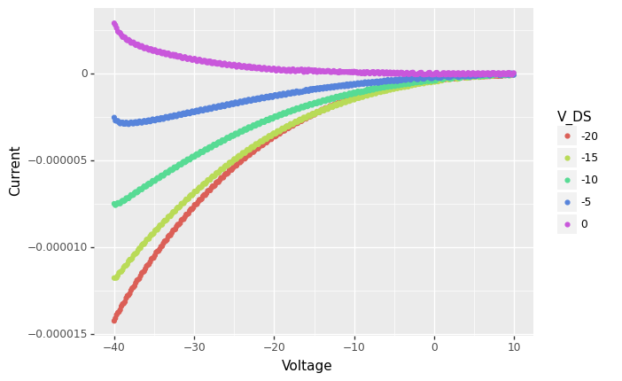
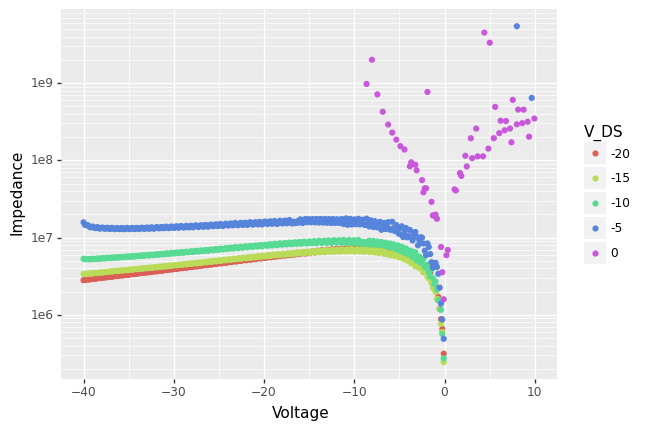

## Reading a data file with multiple data blocks


```python
import numpy as np
import pandas as pd
from matplotlib import pyplot
import matplotlib.pyplot as plt
```


```python
d = pd.read_csv("SIO_2.TXT", delim_whitespace=True,  skiprows=4)
d
```


<div>
<style scoped>
    .dataframe tbody tr th:only-of-type {
        vertical-align: middle;
    }

    .dataframe tbody tr th {
        vertical-align: top;
    }

    .dataframe thead th {
        text-align: right;
    }
</style>
<table border="1" class="dataframe">
  <thead>
    <tr style="text-align: right;">
      <th></th>
      <th>V</th>
      <th>A</th>
    </tr>
  </thead>
  <tbody>
    <tr>
      <th>1</th>
      <td>-40.00</td>
      <td>-1.424200e-05</td>
    </tr>
    <tr>
      <th>2</th>
      <td>-39.85</td>
      <td>-1.409100e-05</td>
    </tr>
    <tr>
      <th>3</th>
      <td>-39.70</td>
      <td>-1.389200e-05</td>
    </tr>
    <tr>
      <th>4</th>
      <td>-39.55</td>
      <td>-1.377300e-05</td>
    </tr>
    <tr>
      <th>5</th>
      <td>-39.40</td>
      <td>-1.372700e-05</td>
    </tr>
    <tr>
      <th>...</th>
      <td>...</td>
      <td>...</td>
    </tr>
    <tr>
      <th>1666</th>
      <td>9.35</td>
      <td>4.619400e-08</td>
    </tr>
    <tr>
      <th>1667</th>
      <td>9.50</td>
      <td>-6.069200e-08</td>
    </tr>
    <tr>
      <th>1668</th>
      <td>9.65</td>
      <td>-7.775500e-08</td>
    </tr>
    <tr>
      <th>1669</th>
      <td>9.80</td>
      <td>-5.004100e-08</td>
    </tr>
    <tr>
      <th>1670</th>
      <td>9.95</td>
      <td>2.859200e-08</td>
    </tr>
  </tbody>
</table>
<p>1670 rows × 2 columns</p>
</div>


```python
with open("SIO_2.TXT") as f:
    head = [next(f) for x in range(4)]
print(head)
```

    ['FET Vds-Id\n', 'VG= -40 to 9.95 in 0.15 step\n', 'VDS= -20 to 0 in 5 step\n', 'NO. VG ID\n']


```python
V_G = np.arange(-40,9.95+0.15,step=0.15) # note arange does not include the endpoint, so we go one step further
V_G.shape
V_DS = np.arange(-20,0+5,step=5) # note arange does not include the endpoint, so we go one step further
V_DS.shape
```


    (5,)


Let's check that the information is consistent with the data


```python
d.shape[0] / V_G.shape[0] == V_DS.shape[0] 

```


    True


```python
# d["V_DS"] = np.tile(V_DS, V_G.shape[0])
d["V_DS"] = np.repeat(V_DS, V_G.shape[0])
d
```


<div>
<style scoped>
    .dataframe tbody tr th:only-of-type {
        vertical-align: middle;
    }

    .dataframe tbody tr th {
        vertical-align: top;
    }

    .dataframe thead th {
        text-align: right;
    }
</style>
<table border="1" class="dataframe">
  <thead>
    <tr style="text-align: right;">
      <th></th>
      <th>V</th>
      <th>A</th>
      <th>V_DS</th>
      <th>ratio</th>
    </tr>
  </thead>
  <tbody>
    <tr>
      <th>1</th>
      <td>-40.00</td>
      <td>-1.424200e-05</td>
      <td>-20</td>
      <td>2.808594e+06</td>
    </tr>
    <tr>
      <th>2</th>
      <td>-39.85</td>
      <td>-1.409100e-05</td>
      <td>-20</td>
      <td>2.828046e+06</td>
    </tr>
    <tr>
      <th>3</th>
      <td>-39.70</td>
      <td>-1.389200e-05</td>
      <td>-20</td>
      <td>2.857760e+06</td>
    </tr>
    <tr>
      <th>4</th>
      <td>-39.55</td>
      <td>-1.377300e-05</td>
      <td>-20</td>
      <td>2.871560e+06</td>
    </tr>
    <tr>
      <th>5</th>
      <td>-39.40</td>
      <td>-1.372700e-05</td>
      <td>-20</td>
      <td>2.870256e+06</td>
    </tr>
    <tr>
      <th>...</th>
      <td>...</td>
      <td>...</td>
      <td>...</td>
      <td>...</td>
    </tr>
    <tr>
      <th>1666</th>
      <td>9.35</td>
      <td>4.619400e-08</td>
      <td>0</td>
      <td>2.024072e+08</td>
    </tr>
    <tr>
      <th>1667</th>
      <td>9.50</td>
      <td>-6.069200e-08</td>
      <td>0</td>
      <td>-1.565280e+08</td>
    </tr>
    <tr>
      <th>1668</th>
      <td>9.65</td>
      <td>-7.775500e-08</td>
      <td>0</td>
      <td>-1.241078e+08</td>
    </tr>
    <tr>
      <th>1669</th>
      <td>9.80</td>
      <td>-5.004100e-08</td>
      <td>0</td>
      <td>-1.958394e+08</td>
    </tr>
    <tr>
      <th>1670</th>
      <td>9.95</td>
      <td>2.859200e-08</td>
      <td>0</td>
      <td>3.479994e+08</td>
    </tr>
  </tbody>
</table>
<p>1670 rows × 4 columns</p>
</div>


We may sometimes want to convert from long to wide format, so that all the measurements are in separate columns:


```python
d.pivot(index='V', columns='V_DS', values='A')
```


<div>
<style scoped>
    .dataframe tbody tr th:only-of-type {
        vertical-align: middle;
    }

    .dataframe tbody tr th {
        vertical-align: top;
    }

    .dataframe thead th {
        text-align: right;
    }
</style>
<table border="1" class="dataframe">
  <thead>
    <tr style="text-align: right;">
      <th>V_DS</th>
      <th>-20</th>
      <th>-15</th>
      <th>-10</th>
      <th>-5</th>
      <th>0</th>
    </tr>
    <tr>
      <th>V</th>
      <th></th>
      <th></th>
      <th></th>
      <th></th>
      <th></th>
    </tr>
  </thead>
  <tbody>
    <tr>
      <th>-40.00</th>
      <td>-1.424200e-05</td>
      <td>-1.177200e-05</td>
      <td>-7.496500e-06</td>
      <td>-2.533700e-06</td>
      <td>2.892200e-06</td>
    </tr>
    <tr>
      <th>-39.85</th>
      <td>-1.409100e-05</td>
      <td>-1.176200e-05</td>
      <td>-7.583800e-06</td>
      <td>-2.718800e-06</td>
      <td>2.782900e-06</td>
    </tr>
    <tr>
      <th>-39.70</th>
      <td>-1.389200e-05</td>
      <td>-1.176300e-05</td>
      <td>-7.524300e-06</td>
      <td>-2.730000e-06</td>
      <td>2.615600e-06</td>
    </tr>
    <tr>
      <th>-39.55</th>
      <td>-1.377300e-05</td>
      <td>-1.163400e-05</td>
      <td>-7.443200e-06</td>
      <td>-2.722000e-06</td>
      <td>2.414700e-06</td>
    </tr>
    <tr>
      <th>-39.40</th>
      <td>-1.372700e-05</td>
      <td>-1.147100e-05</td>
      <td>-7.477000e-06</td>
      <td>-2.816800e-06</td>
      <td>2.359900e-06</td>
    </tr>
    <tr>
      <th>...</th>
      <td>...</td>
      <td>...</td>
      <td>...</td>
      <td>...</td>
      <td>...</td>
    </tr>
    <tr>
      <th>9.35</th>
      <td>-9.515400e-08</td>
      <td>-2.034900e-08</td>
      <td>-1.250400e-07</td>
      <td>-9.001600e-08</td>
      <td>4.619400e-08</td>
    </tr>
    <tr>
      <th>9.50</th>
      <td>-6.714200e-08</td>
      <td>-1.200300e-07</td>
      <td>-6.741000e-08</td>
      <td>-1.037900e-08</td>
      <td>-6.069200e-08</td>
    </tr>
    <tr>
      <th>9.65</th>
      <td>-7.140100e-08</td>
      <td>-7.929000e-08</td>
      <td>-5.859100e-08</td>
      <td>1.502000e-08</td>
      <td>-7.775500e-08</td>
    </tr>
    <tr>
      <th>9.80</th>
      <td>-6.897400e-08</td>
      <td>-5.587900e-08</td>
      <td>-2.203300e-08</td>
      <td>-2.938900e-08</td>
      <td>-5.004100e-08</td>
    </tr>
    <tr>
      <th>9.95</th>
      <td>-6.461200e-08</td>
      <td>-5.862800e-08</td>
      <td>-4.856000e-09</td>
      <td>-9.029000e-08</td>
      <td>2.859200e-08</td>
    </tr>
  </tbody>
</table>
<p>334 rows × 5 columns</p>
</div>


We can now, for example, plot the I/V data by groups:


```python
#conda install -c conda-forge plotnine 
from plotnine import *
# note the use of parentheses, because the syntax below (+) is non-standard in Python
(ggplot(d) +
  geom_point(aes(x = 'V',
                  y = 'A',
                  color = 'factor(V_DS)')) +
  labs(colour = 'V_DS', x = "Voltage", y = "Current"))
```





    <ggplot: (8769427903199)>


Another type of thing we might do with this 'long' format is to transform or summarise the data by V_DS value, with the [split-apply-combine strategy](https://pandas.pydata.org/docs/user_guide/groupby.html):


```python
def IV_ratio(x):
    return  x['V'] / x['A']

d["ratio"] = d.groupby("V_DS").apply(IV_ratio).values
d
```


<div>
<style scoped>
    .dataframe tbody tr th:only-of-type {
        vertical-align: middle;
    }

    .dataframe tbody tr th {
        vertical-align: top;
    }

    .dataframe thead th {
        text-align: right;
    }
</style>
<table border="1" class="dataframe">
  <thead>
    <tr style="text-align: right;">
      <th></th>
      <th>V</th>
      <th>A</th>
      <th>V_DS</th>
      <th>ratio</th>
    </tr>
  </thead>
  <tbody>
    <tr>
      <th>1</th>
      <td>-40.00</td>
      <td>-1.424200e-05</td>
      <td>-20</td>
      <td>2.808594e+06</td>
    </tr>
    <tr>
      <th>2</th>
      <td>-39.85</td>
      <td>-1.409100e-05</td>
      <td>-20</td>
      <td>2.828046e+06</td>
    </tr>
    <tr>
      <th>3</th>
      <td>-39.70</td>
      <td>-1.389200e-05</td>
      <td>-20</td>
      <td>2.857760e+06</td>
    </tr>
    <tr>
      <th>4</th>
      <td>-39.55</td>
      <td>-1.377300e-05</td>
      <td>-20</td>
      <td>2.871560e+06</td>
    </tr>
    <tr>
      <th>5</th>
      <td>-39.40</td>
      <td>-1.372700e-05</td>
      <td>-20</td>
      <td>2.870256e+06</td>
    </tr>
    <tr>
      <th>...</th>
      <td>...</td>
      <td>...</td>
      <td>...</td>
      <td>...</td>
    </tr>
    <tr>
      <th>1666</th>
      <td>9.35</td>
      <td>4.619400e-08</td>
      <td>0</td>
      <td>2.024072e+08</td>
    </tr>
    <tr>
      <th>1667</th>
      <td>9.50</td>
      <td>-6.069200e-08</td>
      <td>0</td>
      <td>-1.565280e+08</td>
    </tr>
    <tr>
      <th>1668</th>
      <td>9.65</td>
      <td>-7.775500e-08</td>
      <td>0</td>
      <td>-1.241078e+08</td>
    </tr>
    <tr>
      <th>1669</th>
      <td>9.80</td>
      <td>-5.004100e-08</td>
      <td>0</td>
      <td>-1.958394e+08</td>
    </tr>
    <tr>
      <th>1670</th>
      <td>9.95</td>
      <td>2.859200e-08</td>
      <td>0</td>
      <td>3.479994e+08</td>
    </tr>
  </tbody>
</table>
<p>1670 rows × 4 columns</p>
</div>


```python
# d.groupby("V_DS").apply(lambda x: x.max() - x.min())
```


```python
(ggplot(d) +
  geom_point(aes(x = 'V',
                  y = 'ratio',
                  color = 'factor(V_DS)')) +
  scale_y_log10() +
  labs(colour = 'V_DS', x = "Voltage", y = "Impedance"))
```

    /Users/baptiste/opt/anaconda3/lib/python3.9/site-packages/pandas/core/arraylike.py:397: RuntimeWarning: invalid value encountered in log10
    /Users/baptiste/opt/anaconda3/lib/python3.9/site-packages/plotnine/layer.py:412: PlotnineWarning: geom_point : Removed 542 rows containing missing values.





    <ggplot: (8769470026379)>


_Download this page [as a Jupyter notebook](https://github.com/vuw-scps/python-physics/raw/master/notebooks/phys345/wrangling_01_singlefile_blocks.ipynb) or as a [standalone Python script](https://github.com/vuw-scps/python-physics/raw/master/scripts/phys345/wrangling_01_singlefile_blocks.py)._
