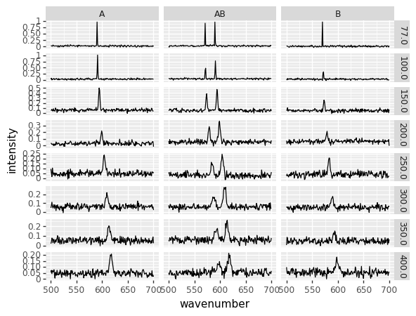

## Reading many similar files from a folder and combining the results


```python
import numpy as np
import pandas as pd
from matplotlib import pyplot
import matplotlib.pyplot as plt
```

First we try to read one file to make sure we're using the correct parameters:


```python
test = pd.read_csv('filenames/Labram_laser514nm_1mW_30sx4_800nmgrating_T-200K_sample-B.txt', delim_whitespace=True, names=['wavenumber','intensity'])
test
```


<div>
<style scoped>
    .dataframe tbody tr th:only-of-type {
        vertical-align: middle;
    }

    .dataframe tbody tr th {
        vertical-align: top;
    }

    .dataframe thead th {
        text-align: right;
    }
</style>
<table border="1" class="dataframe">
  <thead>
    <tr style="text-align: right;">
      <th></th>
      <th>wavenumber</th>
      <th>intensity</th>
    </tr>
  </thead>
  <tbody>
    <tr>
      <th>0</th>
      <td>500</td>
      <td>0.074992</td>
    </tr>
    <tr>
      <th>1</th>
      <td>501</td>
      <td>0.028344</td>
    </tr>
    <tr>
      <th>2</th>
      <td>502</td>
      <td>0.051664</td>
    </tr>
    <tr>
      <th>3</th>
      <td>503</td>
      <td>0.060592</td>
    </tr>
    <tr>
      <th>4</th>
      <td>504</td>
      <td>0.046647</td>
    </tr>
    <tr>
      <th>...</th>
      <td>...</td>
      <td>...</td>
    </tr>
    <tr>
      <th>196</th>
      <td>696</td>
      <td>0.069203</td>
    </tr>
    <tr>
      <th>197</th>
      <td>697</td>
      <td>0.071076</td>
    </tr>
    <tr>
      <th>198</th>
      <td>698</td>
      <td>0.066464</td>
    </tr>
    <tr>
      <th>199</th>
      <td>699</td>
      <td>0.092171</td>
    </tr>
    <tr>
      <th>200</th>
      <td>700</td>
      <td>-0.001873</td>
    </tr>
  </tbody>
</table>
<p>201 rows × 2 columns</p>
</div>


```python

```


```python

```

This seems reasonable, but now we'd like to extract parameters from the filename.


```python
import re
def read_file(f) :
    d = pd.read_csv(f, delim_whitespace=True, names=['wavenumber','intensity'])
    info = f.split('_')
    d['sample'] = re.sub('sample-|.txt','', info[6])
    d['temperature'] = float(re.sub('T-|K','', info[5]))
    
    return(d)

read_file('filenames/Labram_laser514nm_1mW_30sx4_800nmgrating_T-200K_sample-B.txt')
```


<div>
<style scoped>
    .dataframe tbody tr th:only-of-type {
        vertical-align: middle;
    }

    .dataframe tbody tr th {
        vertical-align: top;
    }

    .dataframe thead th {
        text-align: right;
    }
</style>
<table border="1" class="dataframe">
  <thead>
    <tr style="text-align: right;">
      <th></th>
      <th>wavenumber</th>
      <th>intensity</th>
      <th>sample</th>
      <th>temperature</th>
    </tr>
  </thead>
  <tbody>
    <tr>
      <th>0</th>
      <td>500</td>
      <td>0.074992</td>
      <td>B</td>
      <td>200.0</td>
    </tr>
    <tr>
      <th>1</th>
      <td>501</td>
      <td>0.028344</td>
      <td>B</td>
      <td>200.0</td>
    </tr>
    <tr>
      <th>2</th>
      <td>502</td>
      <td>0.051664</td>
      <td>B</td>
      <td>200.0</td>
    </tr>
    <tr>
      <th>3</th>
      <td>503</td>
      <td>0.060592</td>
      <td>B</td>
      <td>200.0</td>
    </tr>
    <tr>
      <th>4</th>
      <td>504</td>
      <td>0.046647</td>
      <td>B</td>
      <td>200.0</td>
    </tr>
    <tr>
      <th>...</th>
      <td>...</td>
      <td>...</td>
      <td>...</td>
      <td>...</td>
    </tr>
    <tr>
      <th>196</th>
      <td>696</td>
      <td>0.069203</td>
      <td>B</td>
      <td>200.0</td>
    </tr>
    <tr>
      <th>197</th>
      <td>697</td>
      <td>0.071076</td>
      <td>B</td>
      <td>200.0</td>
    </tr>
    <tr>
      <th>198</th>
      <td>698</td>
      <td>0.066464</td>
      <td>B</td>
      <td>200.0</td>
    </tr>
    <tr>
      <th>199</th>
      <td>699</td>
      <td>0.092171</td>
      <td>B</td>
      <td>200.0</td>
    </tr>
    <tr>
      <th>200</th>
      <td>700</td>
      <td>-0.001873</td>
      <td>B</td>
      <td>200.0</td>
    </tr>
  </tbody>
</table>
<p>201 rows × 4 columns</p>
</div>


We can now grab all the filenames, and read them in:


```python
import glob
import os

path = r'filenames' 
txt_files = glob.glob(os.path.join(path , "*.txt"))
n = len(txt_files)
txt_files
```


```python
d = pd.concat((read_file(f) for f in txt_files))
d
```


<div>
<style scoped>
    .dataframe tbody tr th:only-of-type {
        vertical-align: middle;
    }

    .dataframe tbody tr th {
        vertical-align: top;
    }

    .dataframe thead th {
        text-align: right;
    }
</style>
<table border="1" class="dataframe">
  <thead>
    <tr style="text-align: right;">
      <th></th>
      <th>wavenumber</th>
      <th>intensity</th>
      <th>sample</th>
      <th>temperature</th>
    </tr>
  </thead>
  <tbody>
    <tr>
      <th>0</th>
      <td>500</td>
      <td>0.074992</td>
      <td>B</td>
      <td>200.0</td>
    </tr>
    <tr>
      <th>1</th>
      <td>501</td>
      <td>0.028344</td>
      <td>B</td>
      <td>200.0</td>
    </tr>
    <tr>
      <th>2</th>
      <td>502</td>
      <td>0.051664</td>
      <td>B</td>
      <td>200.0</td>
    </tr>
    <tr>
      <th>3</th>
      <td>503</td>
      <td>0.060592</td>
      <td>B</td>
      <td>200.0</td>
    </tr>
    <tr>
      <th>4</th>
      <td>504</td>
      <td>0.046647</td>
      <td>B</td>
      <td>200.0</td>
    </tr>
    <tr>
      <th>...</th>
      <td>...</td>
      <td>...</td>
      <td>...</td>
      <td>...</td>
    </tr>
    <tr>
      <th>196</th>
      <td>696</td>
      <td>0.094646</td>
      <td>A</td>
      <td>150.0</td>
    </tr>
    <tr>
      <th>197</th>
      <td>697</td>
      <td>0.087045</td>
      <td>A</td>
      <td>150.0</td>
    </tr>
    <tr>
      <th>198</th>
      <td>698</td>
      <td>0.042058</td>
      <td>A</td>
      <td>150.0</td>
    </tr>
    <tr>
      <th>199</th>
      <td>699</td>
      <td>0.038669</td>
      <td>A</td>
      <td>150.0</td>
    </tr>
    <tr>
      <th>200</th>
      <td>700</td>
      <td>0.040565</td>
      <td>A</td>
      <td>150.0</td>
    </tr>
  </tbody>
</table>
<p>4824 rows × 4 columns</p>
</div>


We now have access to the whole set of variables corresponding to each data point:


```python
from plotnine import *
(ggplot(d) +
  geom_line(aes(x = 'wavenumber',
                  y = 'intensity')) +
  facet_grid('temperature ~ sample', scales='free'))
```





    <ggplot: (8789659312442)>


If needed, we can also reshape the dataset to 'wide' format,  


```python
w = d.pivot(index='wavenumber', columns=['temperature','sample'], values='intensity')
w
```


<div>
<style scoped>
    .dataframe tbody tr th:only-of-type {
        vertical-align: middle;
    }

    .dataframe tbody tr th {
        vertical-align: top;
    }

    .dataframe thead tr th {
        text-align: left;
    }

    .dataframe thead tr:last-of-type th {
        text-align: right;
    }
</style>
<table border="1" class="dataframe">
  <thead>
    <tr>
      <th>temperature</th>
      <th>200.0</th>
      <th>350.0</th>
      <th>300.0</th>
      <th>77.0</th>
      <th>200.0</th>
      <th>350.0</th>
      <th>300.0</th>
      <th>250.0</th>
      <th>150.0</th>
      <th>300.0</th>
      <th>...</th>
      <th>200.0</th>
      <th>400.0</th>
      <th>250.0</th>
      <th colspan="3" halign="left">100.0</th>
      <th>350.0</th>
      <th>400.0</th>
      <th colspan="2" halign="left">150.0</th>
    </tr>
    <tr>
      <th>sample</th>
      <th>B</th>
      <th>B</th>
      <th>AB</th>
      <th>AB</th>
      <th>A</th>
      <th>A</th>
      <th>B</th>
      <th>B</th>
      <th>AB</th>
      <th>A</th>
      <th>...</th>
      <th>AB</th>
      <th>B</th>
      <th>AB</th>
      <th>B</th>
      <th>A</th>
      <th>AB</th>
      <th>AB</th>
      <th>AB</th>
      <th>B</th>
      <th>A</th>
    </tr>
    <tr>
      <th>wavenumber</th>
      <th></th>
      <th></th>
      <th></th>
      <th></th>
      <th></th>
      <th></th>
      <th></th>
      <th></th>
      <th></th>
      <th></th>
      <th></th>
      <th></th>
      <th></th>
      <th></th>
      <th></th>
      <th></th>
      <th></th>
      <th></th>
      <th></th>
      <th></th>
      <th></th>
    </tr>
  </thead>
  <tbody>
    <tr>
      <th>500</th>
      <td>0.074992</td>
      <td>0.004323</td>
      <td>0.076536</td>
      <td>0.013187</td>
      <td>0.040021</td>
      <td>0.019496</td>
      <td>0.061139</td>
      <td>0.024770</td>
      <td>0.044493</td>
      <td>0.047502</td>
      <td>...</td>
      <td>0.065927</td>
      <td>0.097784</td>
      <td>0.048911</td>
      <td>0.030249</td>
      <td>0.034631</td>
      <td>0.053777</td>
      <td>0.053818</td>
      <td>0.050812</td>
      <td>0.045007</td>
      <td>0.053432</td>
    </tr>
    <tr>
      <th>501</th>
      <td>0.028344</td>
      <td>0.085461</td>
      <td>0.046044</td>
      <td>-0.018791</td>
      <td>0.032908</td>
      <td>0.038194</td>
      <td>0.051306</td>
      <td>0.044119</td>
      <td>0.052452</td>
      <td>0.075359</td>
      <td>...</td>
      <td>0.030383</td>
      <td>0.053423</td>
      <td>0.060435</td>
      <td>0.005080</td>
      <td>0.072406</td>
      <td>0.064198</td>
      <td>0.046188</td>
      <td>0.034646</td>
      <td>0.062872</td>
      <td>0.052081</td>
    </tr>
    <tr>
      <th>502</th>
      <td>0.051664</td>
      <td>0.077181</td>
      <td>0.047811</td>
      <td>0.040806</td>
      <td>0.018934</td>
      <td>0.077511</td>
      <td>0.058560</td>
      <td>0.027171</td>
      <td>0.080658</td>
      <td>0.112588</td>
      <td>...</td>
      <td>0.093500</td>
      <td>0.044374</td>
      <td>0.024800</td>
      <td>0.065015</td>
      <td>0.002483</td>
      <td>0.038562</td>
      <td>0.081160</td>
      <td>0.051756</td>
      <td>0.104609</td>
      <td>0.075111</td>
    </tr>
    <tr>
      <th>503</th>
      <td>0.060592</td>
      <td>0.020926</td>
      <td>0.088789</td>
      <td>0.025998</td>
      <td>0.020978</td>
      <td>0.072047</td>
      <td>0.035060</td>
      <td>0.028181</td>
      <td>0.059616</td>
      <td>0.067806</td>
      <td>...</td>
      <td>0.029277</td>
      <td>0.064850</td>
      <td>0.029291</td>
      <td>0.015257</td>
      <td>0.029402</td>
      <td>0.044708</td>
      <td>0.071798</td>
      <td>0.071617</td>
      <td>0.036044</td>
      <td>0.042554</td>
    </tr>
    <tr>
      <th>504</th>
      <td>0.046647</td>
      <td>0.046893</td>
      <td>0.078558</td>
      <td>0.028949</td>
      <td>0.026733</td>
      <td>0.027818</td>
      <td>0.058260</td>
      <td>0.015008</td>
      <td>0.079030</td>
      <td>0.045999</td>
      <td>...</td>
      <td>0.068539</td>
      <td>0.045043</td>
      <td>0.064404</td>
      <td>0.045351</td>
      <td>0.029537</td>
      <td>0.031399</td>
      <td>0.052140</td>
      <td>0.068621</td>
      <td>0.057326</td>
      <td>0.041804</td>
    </tr>
    <tr>
      <th>...</th>
      <td>...</td>
      <td>...</td>
      <td>...</td>
      <td>...</td>
      <td>...</td>
      <td>...</td>
      <td>...</td>
      <td>...</td>
      <td>...</td>
      <td>...</td>
      <td>...</td>
      <td>...</td>
      <td>...</td>
      <td>...</td>
      <td>...</td>
      <td>...</td>
      <td>...</td>
      <td>...</td>
      <td>...</td>
      <td>...</td>
      <td>...</td>
    </tr>
    <tr>
      <th>696</th>
      <td>0.069203</td>
      <td>0.068946</td>
      <td>0.100046</td>
      <td>0.026807</td>
      <td>0.038232</td>
      <td>0.051920</td>
      <td>0.056711</td>
      <td>0.050955</td>
      <td>0.038063</td>
      <td>0.083492</td>
      <td>...</td>
      <td>0.053672</td>
      <td>0.056958</td>
      <td>0.034406</td>
      <td>0.002294</td>
      <td>0.045724</td>
      <td>0.064356</td>
      <td>0.028167</td>
      <td>0.048360</td>
      <td>0.018886</td>
      <td>0.094646</td>
    </tr>
    <tr>
      <th>697</th>
      <td>0.071076</td>
      <td>0.009869</td>
      <td>0.022073</td>
      <td>0.003969</td>
      <td>0.047044</td>
      <td>0.027709</td>
      <td>0.031566</td>
      <td>0.007096</td>
      <td>0.033194</td>
      <td>0.081829</td>
      <td>...</td>
      <td>0.054311</td>
      <td>0.061701</td>
      <td>0.006184</td>
      <td>0.023873</td>
      <td>0.047459</td>
      <td>0.067253</td>
      <td>0.042348</td>
      <td>0.056965</td>
      <td>0.078957</td>
      <td>0.087045</td>
    </tr>
    <tr>
      <th>698</th>
      <td>0.066464</td>
      <td>0.073517</td>
      <td>0.105147</td>
      <td>0.053418</td>
      <td>0.060559</td>
      <td>0.066897</td>
      <td>0.055108</td>
      <td>0.017699</td>
      <td>0.051050</td>
      <td>0.044317</td>
      <td>...</td>
      <td>0.056145</td>
      <td>0.029431</td>
      <td>0.024783</td>
      <td>-0.003111</td>
      <td>0.040905</td>
      <td>0.058880</td>
      <td>0.042994</td>
      <td>0.052892</td>
      <td>0.070674</td>
      <td>0.042058</td>
    </tr>
    <tr>
      <th>699</th>
      <td>0.092171</td>
      <td>0.026258</td>
      <td>0.043518</td>
      <td>0.047509</td>
      <td>0.061322</td>
      <td>0.088515</td>
      <td>0.068128</td>
      <td>0.023275</td>
      <td>0.073509</td>
      <td>0.058521</td>
      <td>...</td>
      <td>0.033373</td>
      <td>0.050172</td>
      <td>0.035225</td>
      <td>0.004628</td>
      <td>0.034977</td>
      <td>0.058225</td>
      <td>0.045544</td>
      <td>0.042894</td>
      <td>0.003739</td>
      <td>0.038669</td>
    </tr>
    <tr>
      <th>700</th>
      <td>-0.001873</td>
      <td>0.063085</td>
      <td>0.040245</td>
      <td>0.034734</td>
      <td>-0.015264</td>
      <td>0.023307</td>
      <td>0.061532</td>
      <td>0.020031</td>
      <td>0.036904</td>
      <td>0.023002</td>
      <td>...</td>
      <td>0.080003</td>
      <td>0.060158</td>
      <td>0.064786</td>
      <td>0.007770</td>
      <td>0.039950</td>
      <td>0.063928</td>
      <td>0.078361</td>
      <td>0.066788</td>
      <td>0.067909</td>
      <td>0.040565</td>
    </tr>
  </tbody>
</table>
<p>201 rows × 24 columns</p>
</div>


Incidentally, the reverse operation can be done with `melt`, and would look like:


```python
var_list=list(w.columns)
l = pd.melt(w, value_vars=var_list,value_name='I', ignore_index=False)
l = l.reset_index(level=['wavenumber']) # trick to convert the confusing (to me) multiindex into a standard column
l
```


<div>
<style scoped>
    .dataframe tbody tr th:only-of-type {
        vertical-align: middle;
    }

    .dataframe tbody tr th {
        vertical-align: top;
    }

    .dataframe thead th {
        text-align: right;
    }
</style>
<table border="1" class="dataframe">
  <thead>
    <tr style="text-align: right;">
      <th></th>
      <th>wavenumber</th>
      <th>temperature</th>
      <th>sample</th>
      <th>I</th>
    </tr>
  </thead>
  <tbody>
    <tr>
      <th>0</th>
      <td>500</td>
      <td>200.0</td>
      <td>B</td>
      <td>0.074992</td>
    </tr>
    <tr>
      <th>1</th>
      <td>501</td>
      <td>200.0</td>
      <td>B</td>
      <td>0.028344</td>
    </tr>
    <tr>
      <th>2</th>
      <td>502</td>
      <td>200.0</td>
      <td>B</td>
      <td>0.051664</td>
    </tr>
    <tr>
      <th>3</th>
      <td>503</td>
      <td>200.0</td>
      <td>B</td>
      <td>0.060592</td>
    </tr>
    <tr>
      <th>4</th>
      <td>504</td>
      <td>200.0</td>
      <td>B</td>
      <td>0.046647</td>
    </tr>
    <tr>
      <th>...</th>
      <td>...</td>
      <td>...</td>
      <td>...</td>
      <td>...</td>
    </tr>
    <tr>
      <th>4819</th>
      <td>696</td>
      <td>150.0</td>
      <td>A</td>
      <td>0.094646</td>
    </tr>
    <tr>
      <th>4820</th>
      <td>697</td>
      <td>150.0</td>
      <td>A</td>
      <td>0.087045</td>
    </tr>
    <tr>
      <th>4821</th>
      <td>698</td>
      <td>150.0</td>
      <td>A</td>
      <td>0.042058</td>
    </tr>
    <tr>
      <th>4822</th>
      <td>699</td>
      <td>150.0</td>
      <td>A</td>
      <td>0.038669</td>
    </tr>
    <tr>
      <th>4823</th>
      <td>700</td>
      <td>150.0</td>
      <td>A</td>
      <td>0.040565</td>
    </tr>
  </tbody>
</table>
<p>4824 rows × 4 columns</p>
</div>


_Download this page [as a Jupyter notebook](https://github.com/vuw-scps/python-physics/raw/master/notebooks/phys345/wrangling_02_folder_filenames.ipynb) or as a [standalone Python script](https://github.com/vuw-scps/python-physics/raw/master/scripts/phys345/wrangling_02_folder_filenames.py)._


