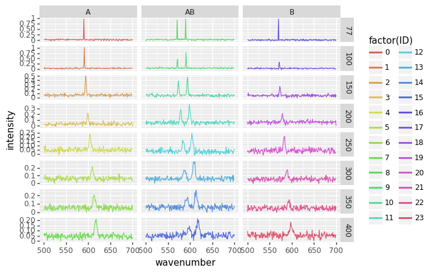

## Reading many similar files from a folder and combining the results with info from a different source


```python
import numpy as np
import pandas as pd
from matplotlib import pyplot
import matplotlib.pyplot as plt
```

First we try to read one file to make sure we're using the correct parameters:


```python
test = pd.read_csv('metadata/001.txt', delim_whitespace=True, names=['wavenumber','intensity'])
test
```


<div>
<style scoped>
    .dataframe tbody tr th:only-of-type {
        vertical-align: middle;
    }

    .dataframe tbody tr th {
        vertical-align: top;
    }

    .dataframe thead th {
        text-align: right;
    }
</style>
<table border="1" class="dataframe">
  <thead>
    <tr style="text-align: right;">
      <th></th>
      <th>wavenumber</th>
      <th>intensity</th>
    </tr>
  </thead>
  <tbody>
    <tr>
      <th>0</th>
      <td>500</td>
      <td>0.029038</td>
    </tr>
    <tr>
      <th>1</th>
      <td>501</td>
      <td>0.036377</td>
    </tr>
    <tr>
      <th>2</th>
      <td>502</td>
      <td>0.022507</td>
    </tr>
    <tr>
      <th>3</th>
      <td>503</td>
      <td>0.017778</td>
    </tr>
    <tr>
      <th>4</th>
      <td>504</td>
      <td>0.062998</td>
    </tr>
    <tr>
      <th>...</th>
      <td>...</td>
      <td>...</td>
    </tr>
    <tr>
      <th>196</th>
      <td>696</td>
      <td>0.021754</td>
    </tr>
    <tr>
      <th>197</th>
      <td>697</td>
      <td>0.005134</td>
    </tr>
    <tr>
      <th>198</th>
      <td>698</td>
      <td>0.036723</td>
    </tr>
    <tr>
      <th>199</th>
      <td>699</td>
      <td>0.013820</td>
    </tr>
    <tr>
      <th>200</th>
      <td>700</td>
      <td>0.043075</td>
    </tr>
  </tbody>
</table>
<p>201 rows × 2 columns</p>
</div>


```python
import glob
import os

path = r'metadata' 
txt_files = glob.glob(os.path.join(path , "[0-9][0-9][0-9].txt"))
n = len(txt_files)
txt_files.sort()
txt_files
```


    ['metadata/001.txt',
     'metadata/002.txt',
     'metadata/003.txt',
     'metadata/004.txt',
     'metadata/005.txt',
     'metadata/006.txt',
     'metadata/007.txt',
     'metadata/008.txt',
     'metadata/009.txt',
     'metadata/010.txt',
     'metadata/011.txt',
     'metadata/012.txt',
     'metadata/013.txt',
     'metadata/014.txt',
     'metadata/015.txt',
     'metadata/016.txt',
     'metadata/017.txt',
     'metadata/018.txt',
     'metadata/019.txt',
     'metadata/020.txt',
     'metadata/021.txt',
     'metadata/022.txt',
     'metadata/023.txt',
     'metadata/024.txt']


```python
d = pd.concat((pd.read_csv(f, delim_whitespace=True, names=['wavenumber','intensity']) for f in txt_files), ignore_index=False, keys=range(n), names=['ID','row'])
d = d.reset_index(level=['ID']) # trick to convert the confusing (to me) multiindex into a standard column
d
```


<div>
<style scoped>
    .dataframe tbody tr th:only-of-type {
        vertical-align: middle;
    }

    .dataframe tbody tr th {
        vertical-align: top;
    }

    .dataframe thead th {
        text-align: right;
    }
</style>
<table border="1" class="dataframe">
  <thead>
    <tr style="text-align: right;">
      <th></th>
      <th>ID</th>
      <th>wavenumber</th>
      <th>intensity</th>
    </tr>
    <tr>
      <th>row</th>
      <th></th>
      <th></th>
      <th></th>
    </tr>
  </thead>
  <tbody>
    <tr>
      <th>0</th>
      <td>0</td>
      <td>500</td>
      <td>0.029038</td>
    </tr>
    <tr>
      <th>1</th>
      <td>0</td>
      <td>501</td>
      <td>0.036377</td>
    </tr>
    <tr>
      <th>2</th>
      <td>0</td>
      <td>502</td>
      <td>0.022507</td>
    </tr>
    <tr>
      <th>3</th>
      <td>0</td>
      <td>503</td>
      <td>0.017778</td>
    </tr>
    <tr>
      <th>4</th>
      <td>0</td>
      <td>504</td>
      <td>0.062998</td>
    </tr>
    <tr>
      <th>...</th>
      <td>...</td>
      <td>...</td>
      <td>...</td>
    </tr>
    <tr>
      <th>196</th>
      <td>23</td>
      <td>696</td>
      <td>0.056958</td>
    </tr>
    <tr>
      <th>197</th>
      <td>23</td>
      <td>697</td>
      <td>0.061701</td>
    </tr>
    <tr>
      <th>198</th>
      <td>23</td>
      <td>698</td>
      <td>0.029431</td>
    </tr>
    <tr>
      <th>199</th>
      <td>23</td>
      <td>699</td>
      <td>0.050172</td>
    </tr>
    <tr>
      <th>200</th>
      <td>23</td>
      <td>700</td>
      <td>0.060158</td>
    </tr>
  </tbody>
</table>
<p>4824 rows × 3 columns</p>
</div>


Let's plot these to check that it makes sense:


```python
#conda install -c conda-forge plotnine 
from plotnine import *
# note the use of parentheses, because the syntax below (+) is non-standard in Python
(ggplot(d) +
  geom_line(aes(x = 'wavenumber',
                  y = 'intensity+ID/10',
                  color = 'factor(ID)')))
```


    <ggplot: (8782924166551)>


This seems reasonable, but now we'd like to retrieve the parameters for each file, which are stored in file `parameters.txt`.


```python
meta = pd.read_csv('metadata/parameters.txt', delim_whitespace=True)

meta['ID'] = range(meta.shape[0])
meta

```


<div>
<style scoped>
    .dataframe tbody tr th:only-of-type {
        vertical-align: middle;
    }

    .dataframe tbody tr th {
        vertical-align: top;
    }

    .dataframe thead th {
        text-align: right;
    }
</style>
<table border="1" class="dataframe">
  <thead>
    <tr style="text-align: right;">
      <th></th>
      <th>temperature</th>
      <th>sample</th>
      <th>ID</th>
    </tr>
  </thead>
  <tbody>
    <tr>
      <th>0</th>
      <td>77</td>
      <td>A</td>
      <td>0</td>
    </tr>
    <tr>
      <th>1</th>
      <td>100</td>
      <td>A</td>
      <td>1</td>
    </tr>
    <tr>
      <th>2</th>
      <td>150</td>
      <td>A</td>
      <td>2</td>
    </tr>
    <tr>
      <th>3</th>
      <td>200</td>
      <td>A</td>
      <td>3</td>
    </tr>
    <tr>
      <th>4</th>
      <td>250</td>
      <td>A</td>
      <td>4</td>
    </tr>
    <tr>
      <th>5</th>
      <td>300</td>
      <td>A</td>
      <td>5</td>
    </tr>
    <tr>
      <th>6</th>
      <td>350</td>
      <td>A</td>
      <td>6</td>
    </tr>
    <tr>
      <th>7</th>
      <td>400</td>
      <td>A</td>
      <td>7</td>
    </tr>
    <tr>
      <th>8</th>
      <td>77</td>
      <td>AB</td>
      <td>8</td>
    </tr>
    <tr>
      <th>9</th>
      <td>100</td>
      <td>AB</td>
      <td>9</td>
    </tr>
    <tr>
      <th>10</th>
      <td>150</td>
      <td>AB</td>
      <td>10</td>
    </tr>
    <tr>
      <th>11</th>
      <td>200</td>
      <td>AB</td>
      <td>11</td>
    </tr>
    <tr>
      <th>12</th>
      <td>250</td>
      <td>AB</td>
      <td>12</td>
    </tr>
    <tr>
      <th>13</th>
      <td>300</td>
      <td>AB</td>
      <td>13</td>
    </tr>
    <tr>
      <th>14</th>
      <td>350</td>
      <td>AB</td>
      <td>14</td>
    </tr>
    <tr>
      <th>15</th>
      <td>400</td>
      <td>AB</td>
      <td>15</td>
    </tr>
    <tr>
      <th>16</th>
      <td>77</td>
      <td>B</td>
      <td>16</td>
    </tr>
    <tr>
      <th>17</th>
      <td>100</td>
      <td>B</td>
      <td>17</td>
    </tr>
    <tr>
      <th>18</th>
      <td>150</td>
      <td>B</td>
      <td>18</td>
    </tr>
    <tr>
      <th>19</th>
      <td>200</td>
      <td>B</td>
      <td>19</td>
    </tr>
    <tr>
      <th>20</th>
      <td>250</td>
      <td>B</td>
      <td>20</td>
    </tr>
    <tr>
      <th>21</th>
      <td>300</td>
      <td>B</td>
      <td>21</td>
    </tr>
    <tr>
      <th>22</th>
      <td>350</td>
      <td>B</td>
      <td>22</td>
    </tr>
    <tr>
      <th>23</th>
      <td>400</td>
      <td>B</td>
      <td>23</td>
    </tr>
  </tbody>
</table>
</div>


Now we need to join those two data sets:


```python
full = pd.merge(d, meta, on='ID')
```

We now have access to the whole set of variables corresponding to each data point:


```python
(ggplot(full) +
  geom_line(aes(x = 'wavenumber',
                  y = 'intensity',
                  color = 'factor(ID)')) +
  facet_grid('temperature ~ sample', scales='free'))
```





    <ggplot: (8782839719434)>


_Download this page [as a Jupyter notebook](https://github.com/vuw-scps/python-physics/raw/master/notebooks/phys345/wrangling_03_folder_files_meta.ipynb) or as a [standalone Python script](https://github.com/vuw-scps/python-physics/raw/master/scripts/phys345/wrangling_03_folder_files_meta.py)._


```python

```


```python

```


```python

```
