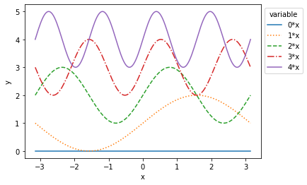
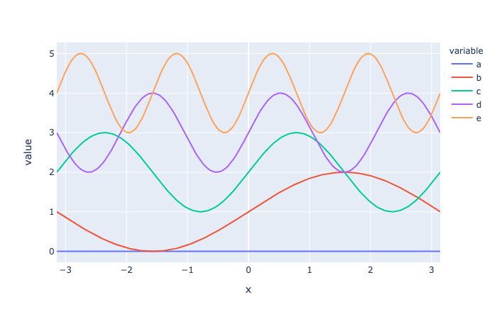

## Basic plots


```python
import numpy as np
import matplotlib.pyplot as plt
```

## Line plot

Let's plot a few sine functions with different line types; we assign a label to each trace, which can be displayed in a legend.


```python
x = np.linspace(-np.pi,np.pi, 200)

lts = ['-',':','--','-.','-']

for i in range(5):
    plt.plot(x, np.sin(i*x)+i,lts[i],label="{0}*x".format(i))
    
plt.ylabel("y")
plt.xlabel("x")
plt.legend(ncol=1,bbox_to_anchor=(1.0,1), title='variable')
plt.show()
```


## Scatter plot


```python
x = np.linspace(-np.pi,np.pi, 20)

marker = ["." , ",", "o", "v", "^"]
for i in range(5):
    plt.scatter(x, np.sin(x)+i, c = 'brown', marker=marker[i], label="{0}*x".format(i))
    
plt.ylabel("y")
plt.xlabel("x")
plt.legend(ncol=1,bbox_to_anchor=(1.0,1), title='variable')
plt.show()
```





## Subplots

To display multiple plots side-by-side, set up a subplot. Note the slightly different syntax for labels etc. 


```python
fig,ax=plt.subplots(2,1,sharex='col')

for i in range(5):
    ax[0].plot(x,np.sin(i*x)+i,lts[i],label="{0}*x".format(i))
    ax[1].plot(x,np.cos(i*x)+i,lts[i]                        )
    
ax[0].set_ylabel("sin")
ax[1].set_ylabel("cos")
ax[1].set_xlabel("x")
ax[0].legend(ncol=5,bbox_to_anchor=(0.1,1.02))
plt.show()
```


## Grammar of graphics with Pandas

An alternative is to create plots following _a grammar of graphics_, such as implemented in [plotly](https://plotly.com/python). Data should typically be prepared in long format [`Panda ` `DataFrame`s](https://pandas.pydata.org/).


```python
import pandas as pd

x = np.linspace(-np.pi,np.pi, 200)
mat = [np.sin(i*x.T) + i for i in range(5)]

# set column names to refer to them
columns = ['a','b','c','d','e']

d = pd.DataFrame(dict(zip(columns, mat)))
d['x'] = x
d.head()
```


<div>
<style scoped>
    .dataframe tbody tr th:only-of-type {
        vertical-align: middle;
    }

    .dataframe tbody tr th {
        vertical-align: top;
    }

    .dataframe thead th {
        text-align: right;
    }
</style>
<table border="1" class="dataframe">
  <thead>
    <tr style="text-align: right;">
      <th></th>
      <th>a</th>
      <th>b</th>
      <th>c</th>
      <th>d</th>
      <th>e</th>
      <th>x</th>
    </tr>
  </thead>
  <tbody>
    <tr>
      <th>0</th>
      <td>0.0</td>
      <td>1.000000</td>
      <td>2.000000</td>
      <td>3.000000</td>
      <td>4.000000</td>
      <td>-3.141593</td>
    </tr>
    <tr>
      <th>1</th>
      <td>0.0</td>
      <td>0.968431</td>
      <td>2.063106</td>
      <td>2.905420</td>
      <td>4.125960</td>
      <td>-3.110019</td>
    </tr>
    <tr>
      <th>2</th>
      <td>0.0</td>
      <td>0.936894</td>
      <td>2.125960</td>
      <td>2.811688</td>
      <td>4.249913</td>
      <td>-3.078445</td>
    </tr>
    <tr>
      <th>3</th>
      <td>0.0</td>
      <td>0.905420</td>
      <td>2.188312</td>
      <td>2.719645</td>
      <td>4.369885</td>
      <td>-3.046871</td>
    </tr>
    <tr>
      <th>4</th>
      <td>0.0</td>
      <td>0.874040</td>
      <td>2.249913</td>
      <td>2.630115</td>
      <td>4.483966</td>
      <td>-3.015297</td>
    </tr>
  </tbody>
</table>
</div>


Converting from this wide format to long format can be achieved with `melt`,


```python
m = pd.melt(d, id_vars='x')
m.head()          
```


<div>
<style scoped>
    .dataframe tbody tr th:only-of-type {
        vertical-align: middle;
    }

    .dataframe tbody tr th {
        vertical-align: top;
    }

    .dataframe thead th {
        text-align: right;
    }
</style>
<table border="1" class="dataframe">
  <thead>
    <tr style="text-align: right;">
      <th></th>
      <th>x</th>
      <th>variable</th>
      <th>value</th>
    </tr>
  </thead>
  <tbody>
    <tr>
      <th>0</th>
      <td>-3.141593</td>
      <td>a</td>
      <td>0.0</td>
    </tr>
    <tr>
      <th>1</th>
      <td>-3.110019</td>
      <td>a</td>
      <td>0.0</td>
    </tr>
    <tr>
      <th>2</th>
      <td>-3.078445</td>
      <td>a</td>
      <td>0.0</td>
    </tr>
    <tr>
      <th>3</th>
      <td>-3.046871</td>
      <td>a</td>
      <td>0.0</td>
    </tr>
    <tr>
      <th>4</th>
      <td>-3.015297</td>
      <td>a</td>
      <td>0.0</td>
    </tr>
  </tbody>
</table>
</div>


```python
import plotly.express as px
import plotly.graph_objects as go
import plotly.io as pio
pio.renderers
# pio.renderers.default = "browser"

fig = px.line(m, x='x', y='value', color='variable')
fig.show(renderer='png')

```





```python

#fig = go.Figure()

# Add scatter trace with medium sized markers
#fig.add_trace(
#    go.Scatter(mode='lines',
#        x=m['x'],
#        y=m['value']))

```


<div>


            <div id="3d7ba138-7085-41b5-89c9-7014ffbbfdc8" class="plotly-graph-div" style="height:525px; width:100%;"></div>
            <script type="text/javascript">
                require(["plotly"], function(Plotly) {
                    window.PLOTLYENV=window.PLOTLYENV || {};

                if (document.getElementById("3d7ba138-7085-41b5-89c9-7014ffbbfdc8")) {
                    Plotly.newPlot(
                        '3d7ba138-7085-41b5-89c9-7014ffbbfdc8',
                        [{"mode": "lines", "type": "scatter", "x": [-3.141592653589793, -3.110018858076328, -3.0784450625628628, -3.046871267049397, -3.015297471535932, -2.983723676022467, -2.9521498805090016, -2.9205760849955364, -2.889002289482071, -2.8574284939686057, -2.8258546984551405, -2.7942809029416753, -2.76270710742821, -2.7311333119147445, -2.6995595164012793, -2.667985720887814, -2.636411925374349, -2.604838129860884, -2.573264334347418, -2.5416905388339535, -2.510116743320488, -2.4785429478070227, -2.4469691522935575, -2.4153953567800923, -2.383821561266627, -2.3522477657531615, -2.3206739702396963, -2.289100174726231, -2.257526379212766, -2.225952583699301, -2.194378788185835, -2.16280499267237, -2.131231197158905, -2.0996574016454397, -2.0680836061319745, -2.036509810618509, -2.0049360151050437, -1.9733622195915785, -1.9417884240781134, -1.910214628564648, -1.8786408330511828, -1.8470670375377176, -1.8154932420242522, -1.783919446510787, -1.7523456509973219, -1.7207718554838565, -1.6891980599703913, -1.657624264456926, -1.6260504689434607, -1.5944766734299956, -1.5629028779165302, -1.531329082403065, -1.4997552868895996, -1.4681814913761344, -1.4366076958626692, -1.4050339003492038, -1.3734601048357387, -1.3418863093222735, -1.310312513808808, -1.278738718295343, -1.2471649227818777, -1.2155911272684123, -1.1840173317549472, -1.1524435362414818, -1.1208697407280166, -1.0892959452145514, -1.0577221497010862, -1.0261483541876206, -0.9945745586741555, -0.9630007631606903, -0.9314269676472251, -0.8998531721337599, -0.8682793766202943, -0.8367055811068291, -0.805131785593364, -0.7735579900798988, -0.7419841945664336, -0.7104103990529684, -0.6788366035395028, -0.6472628080260376, -0.6156890125125725, -0.5841152169991073, -0.5525414214856421, -0.5209676259721765, -0.4893938304587113, -0.45782003494524615, -0.42624623943178097, -0.3946724439183158, -0.3630986484048506, -0.331524852891385, -0.2999510573779198, -0.26837726186445465, -0.23680346635098948, -0.2052296708375243, -0.17365587532405868, -0.1420820798105935, -0.11050828429712833, -0.07893448878366316, -0.047360693270197984, -0.015786897756732365, 0.01578689775673281, 0.047360693270197984, 0.07893448878366316, 0.11050828429712833, 0.14208207981059395, 0.17365587532405913, 0.2052296708375243, 0.23680346635098948, 0.26837726186445465, 0.2999510573779198, 0.33152485289138545, 0.3630986484048506, 0.3946724439183158, 0.42624623943178097, 0.45782003494524615, 0.48939383045871176, 0.5209676259721769, 0.5525414214856421, 0.5841152169991073, 0.6156890125125725, 0.6472628080260376, 0.6788366035395033, 0.7104103990529684, 0.7419841945664336, 0.7735579900798988, 0.805131785593364, 0.8367055811068296, 0.8682793766202943, 0.8998531721337599, 0.9314269676472255, 0.9630007631606903, 0.9945745586741559, 1.0261483541876206, 1.0577221497010862, 1.0892959452145519, 1.1208697407280166, 1.1524435362414822, 1.184017331754947, 1.2155911272684126, 1.2471649227818782, 1.278738718295343, 1.3103125138088085, 1.3418863093222733, 1.3734601048357389, 1.4050339003492045, 1.4366076958626692, 1.4681814913761349, 1.4997552868895996, 1.5313290824030652, 1.56290287791653, 1.5944766734299956, 1.6260504689434612, 1.657624264456926, 1.6891980599703915, 1.7207718554838562, 1.7523456509973219, 1.7839194465107875, 1.8154932420242522, 1.8470670375377178, 1.8786408330511826, 1.9102146285646482, 1.9417884240781138, 1.9733622195915785, 2.004936015105044, 2.036509810618509, 2.0680836061319745, 2.09965740164544, 2.131231197158905, 2.1628049926723705, 2.194378788185835, 2.225952583699301, 2.2575263792127664, 2.289100174726231, 2.320673970239697, 2.3522477657531615, 2.383821561266627, 2.415395356780092, 2.4469691522935575, 2.478542947807023, 2.510116743320488, 2.5416905388339535, 2.573264334347418, 2.604838129860884, 2.6364119253743494, 2.667985720887814, 2.69955951640128, 2.7311333119147445, 2.76270710742821, 2.7942809029416757, 2.8258546984551405, 2.857428493968606, 2.889002289482071, 2.9205760849955364, 2.952149880509002, 2.983723676022467, 3.0152974715359324, 3.046871267049397, 3.0784450625628628, 3.1100188580763284, 3.141592653589793, -3.141592653589793, -3.110018858076328, -3.0784450625628628, -3.046871267049397, -3.015297471535932, -2.983723676022467, -2.9521498805090016, -2.9205760849955364, -2.889002289482071, -2.8574284939686057, -2.8258546984551405, -2.7942809029416753, -2.76270710742821, -2.7311333119147445, -2.6995595164012793, -2.667985720887814, -2.636411925374349, -2.604838129860884, -2.573264334347418, -2.5416905388339535, -2.510116743320488, -2.4785429478070227, -2.4469691522935575, -2.4153953567800923, -2.383821561266627, -2.3522477657531615, -2.3206739702396963, -2.289100174726231, -2.257526379212766, -2.225952583699301, -2.194378788185835, -2.16280499267237, -2.131231197158905, -2.0996574016454397, -2.0680836061319745, -2.036509810618509, -2.0049360151050437, -1.9733622195915785, -1.9417884240781134, -1.910214628564648, -1.8786408330511828, -1.8470670375377176, -1.8154932420242522, -1.783919446510787, -1.7523456509973219, -1.7207718554838565, -1.6891980599703913, -1.657624264456926, -1.6260504689434607, -1.5944766734299956, -1.5629028779165302, -1.531329082403065, -1.4997552868895996, -1.4681814913761344, -1.4366076958626692, -1.4050339003492038, -1.3734601048357387, -1.3418863093222735, -1.310312513808808, -1.278738718295343, -1.2471649227818777, -1.2155911272684123, -1.1840173317549472, -1.1524435362414818, -1.1208697407280166, -1.0892959452145514, -1.0577221497010862, -1.0261483541876206, -0.9945745586741555, -0.9630007631606903, -0.9314269676472251, -0.8998531721337599, -0.8682793766202943, -0.8367055811068291, -0.805131785593364, -0.7735579900798988, -0.7419841945664336, -0.7104103990529684, -0.6788366035395028, -0.6472628080260376, -0.6156890125125725, -0.5841152169991073, -0.5525414214856421, -0.5209676259721765, -0.4893938304587113, -0.45782003494524615, -0.42624623943178097, -0.3946724439183158, -0.3630986484048506, -0.331524852891385, -0.2999510573779198, -0.26837726186445465, -0.23680346635098948, -0.2052296708375243, -0.17365587532405868, -0.1420820798105935, -0.11050828429712833, -0.07893448878366316, -0.047360693270197984, -0.015786897756732365, 0.01578689775673281, 0.047360693270197984, 0.07893448878366316, 0.11050828429712833, 0.14208207981059395, 0.17365587532405913, 0.2052296708375243, 0.23680346635098948, 0.26837726186445465, 0.2999510573779198, 0.33152485289138545, 0.3630986484048506, 0.3946724439183158, 0.42624623943178097, 0.45782003494524615, 0.48939383045871176, 0.5209676259721769, 0.5525414214856421, 0.5841152169991073, 0.6156890125125725, 0.6472628080260376, 0.6788366035395033, 0.7104103990529684, 0.7419841945664336, 0.7735579900798988, 0.805131785593364, 0.8367055811068296, 0.8682793766202943, 0.8998531721337599, 0.9314269676472255, 0.9630007631606903, 0.9945745586741559, 1.0261483541876206, 1.0577221497010862, 1.0892959452145519, 1.1208697407280166, 1.1524435362414822, 1.184017331754947, 1.2155911272684126, 1.2471649227818782, 1.278738718295343, 1.3103125138088085, 1.3418863093222733, 1.3734601048357389, 1.4050339003492045, 1.4366076958626692, 1.4681814913761349, 1.4997552868895996, 1.5313290824030652, 1.56290287791653, 1.5944766734299956, 1.6260504689434612, 1.657624264456926, 1.6891980599703915, 1.7207718554838562, 1.7523456509973219, 1.7839194465107875, 1.8154932420242522, 1.8470670375377178, 1.8786408330511826, 1.9102146285646482, 1.9417884240781138, 1.9733622195915785, 2.004936015105044, 2.036509810618509, 2.0680836061319745, 2.09965740164544, 2.131231197158905, 2.1628049926723705, 2.194378788185835, 2.225952583699301, 2.2575263792127664, 2.289100174726231, 2.320673970239697, 2.3522477657531615, 2.383821561266627, 2.415395356780092, 2.4469691522935575, 2.478542947807023, 2.510116743320488, 2.5416905388339535, 2.573264334347418, 2.604838129860884, 2.6364119253743494, 2.667985720887814, 2.69955951640128, 2.7311333119147445, 2.76270710742821, 2.7942809029416757, 2.8258546984551405, 2.857428493968606, 2.889002289482071, 2.9205760849955364, 2.952149880509002, 2.983723676022467, 3.0152974715359324, 3.046871267049397, 3.0784450625628628, 3.1100188580763284, 3.141592653589793, -3.141592653589793, -3.110018858076328, -3.0784450625628628, -3.046871267049397, -3.015297471535932, -2.983723676022467, -2.9521498805090016, -2.9205760849955364, -2.889002289482071, -2.8574284939686057, -2.8258546984551405, -2.7942809029416753, -2.76270710742821, -2.7311333119147445, -2.6995595164012793, -2.667985720887814, -2.636411925374349, -2.604838129860884, -2.573264334347418, -2.5416905388339535, -2.510116743320488, -2.4785429478070227, -2.4469691522935575, -2.4153953567800923, -2.383821561266627, -2.3522477657531615, -2.3206739702396963, -2.289100174726231, -2.257526379212766, -2.225952583699301, -2.194378788185835, -2.16280499267237, -2.131231197158905, -2.0996574016454397, -2.0680836061319745, -2.036509810618509, -2.0049360151050437, -1.9733622195915785, -1.9417884240781134, -1.910214628564648, -1.8786408330511828, -1.8470670375377176, -1.8154932420242522, -1.783919446510787, -1.7523456509973219, -1.7207718554838565, -1.6891980599703913, -1.657624264456926, -1.6260504689434607, -1.5944766734299956, -1.5629028779165302, -1.531329082403065, -1.4997552868895996, -1.4681814913761344, -1.4366076958626692, -1.4050339003492038, -1.3734601048357387, -1.3418863093222735, -1.310312513808808, -1.278738718295343, -1.2471649227818777, -1.2155911272684123, -1.1840173317549472, -1.1524435362414818, -1.1208697407280166, -1.0892959452145514, -1.0577221497010862, -1.0261483541876206, -0.9945745586741555, -0.9630007631606903, -0.9314269676472251, -0.8998531721337599, -0.8682793766202943, -0.8367055811068291, -0.805131785593364, -0.7735579900798988, -0.7419841945664336, -0.7104103990529684, -0.6788366035395028, -0.6472628080260376, -0.6156890125125725, -0.5841152169991073, -0.5525414214856421, -0.5209676259721765, -0.4893938304587113, -0.45782003494524615, -0.42624623943178097, -0.3946724439183158, -0.3630986484048506, -0.331524852891385, -0.2999510573779198, -0.26837726186445465, -0.23680346635098948, -0.2052296708375243, -0.17365587532405868, -0.1420820798105935, -0.11050828429712833, -0.07893448878366316, -0.047360693270197984, -0.015786897756732365, 0.01578689775673281, 0.047360693270197984, 0.07893448878366316, 0.11050828429712833, 0.14208207981059395, 0.17365587532405913, 0.2052296708375243, 0.23680346635098948, 0.26837726186445465, 0.2999510573779198, 0.33152485289138545, 0.3630986484048506, 0.3946724439183158, 0.42624623943178097, 0.45782003494524615, 0.48939383045871176, 0.5209676259721769, 0.5525414214856421, 0.5841152169991073, 0.6156890125125725, 0.6472628080260376, 0.6788366035395033, 0.7104103990529684, 0.7419841945664336, 0.7735579900798988, 0.805131785593364, 0.8367055811068296, 0.8682793766202943, 0.8998531721337599, 0.9314269676472255, 0.9630007631606903, 0.9945745586741559, 1.0261483541876206, 1.0577221497010862, 1.0892959452145519, 1.1208697407280166, 1.1524435362414822, 1.184017331754947, 1.2155911272684126, 1.2471649227818782, 1.278738718295343, 1.3103125138088085, 1.3418863093222733, 1.3734601048357389, 1.4050339003492045, 1.4366076958626692, 1.4681814913761349, 1.4997552868895996, 1.5313290824030652, 1.56290287791653, 1.5944766734299956, 1.6260504689434612, 1.657624264456926, 1.6891980599703915, 1.7207718554838562, 1.7523456509973219, 1.7839194465107875, 1.8154932420242522, 1.8470670375377178, 1.8786408330511826, 1.9102146285646482, 1.9417884240781138, 1.9733622195915785, 2.004936015105044, 2.036509810618509, 2.0680836061319745, 2.09965740164544, 2.131231197158905, 2.1628049926723705, 2.194378788185835, 2.225952583699301, 2.2575263792127664, 2.289100174726231, 2.320673970239697, 2.3522477657531615, 2.383821561266627, 2.415395356780092, 2.4469691522935575, 2.478542947807023, 2.510116743320488, 2.5416905388339535, 2.573264334347418, 2.604838129860884, 2.6364119253743494, 2.667985720887814, 2.69955951640128, 2.7311333119147445, 2.76270710742821, 2.7942809029416757, 2.8258546984551405, 2.857428493968606, 2.889002289482071, 2.9205760849955364, 2.952149880509002, 2.983723676022467, 3.0152974715359324, 3.046871267049397, 3.0784450625628628, 3.1100188580763284, 3.141592653589793, -3.141592653589793, -3.110018858076328, -3.0784450625628628, -3.046871267049397, -3.015297471535932, -2.983723676022467, -2.9521498805090016, -2.9205760849955364, -2.889002289482071, -2.8574284939686057, -2.8258546984551405, -2.7942809029416753, -2.76270710742821, -2.7311333119147445, -2.6995595164012793, -2.667985720887814, -2.636411925374349, -2.604838129860884, -2.573264334347418, -2.5416905388339535, -2.510116743320488, -2.4785429478070227, -2.4469691522935575, -2.4153953567800923, -2.383821561266627, -2.3522477657531615, -2.3206739702396963, -2.289100174726231, -2.257526379212766, -2.225952583699301, -2.194378788185835, -2.16280499267237, -2.131231197158905, -2.0996574016454397, -2.0680836061319745, -2.036509810618509, -2.0049360151050437, -1.9733622195915785, -1.9417884240781134, -1.910214628564648, -1.8786408330511828, -1.8470670375377176, -1.8154932420242522, -1.783919446510787, -1.7523456509973219, -1.7207718554838565, -1.6891980599703913, -1.657624264456926, -1.6260504689434607, -1.5944766734299956, -1.5629028779165302, -1.531329082403065, -1.4997552868895996, -1.4681814913761344, -1.4366076958626692, -1.4050339003492038, -1.3734601048357387, -1.3418863093222735, -1.310312513808808, -1.278738718295343, -1.2471649227818777, -1.2155911272684123, -1.1840173317549472, -1.1524435362414818, -1.1208697407280166, -1.0892959452145514, -1.0577221497010862, -1.0261483541876206, -0.9945745586741555, -0.9630007631606903, -0.9314269676472251, -0.8998531721337599, -0.8682793766202943, -0.8367055811068291, -0.805131785593364, -0.7735579900798988, -0.7419841945664336, -0.7104103990529684, -0.6788366035395028, -0.6472628080260376, -0.6156890125125725, -0.5841152169991073, -0.5525414214856421, -0.5209676259721765, -0.4893938304587113, -0.45782003494524615, -0.42624623943178097, -0.3946724439183158, -0.3630986484048506, -0.331524852891385, -0.2999510573779198, -0.26837726186445465, -0.23680346635098948, -0.2052296708375243, -0.17365587532405868, -0.1420820798105935, -0.11050828429712833, -0.07893448878366316, -0.047360693270197984, -0.015786897756732365, 0.01578689775673281, 0.047360693270197984, 0.07893448878366316, 0.11050828429712833, 0.14208207981059395, 0.17365587532405913, 0.2052296708375243, 0.23680346635098948, 0.26837726186445465, 0.2999510573779198, 0.33152485289138545, 0.3630986484048506, 0.3946724439183158, 0.42624623943178097, 0.45782003494524615, 0.48939383045871176, 0.5209676259721769, 0.5525414214856421, 0.5841152169991073, 0.6156890125125725, 0.6472628080260376, 0.6788366035395033, 0.7104103990529684, 0.7419841945664336, 0.7735579900798988, 0.805131785593364, 0.8367055811068296, 0.8682793766202943, 0.8998531721337599, 0.9314269676472255, 0.9630007631606903, 0.9945745586741559, 1.0261483541876206, 1.0577221497010862, 1.0892959452145519, 1.1208697407280166, 1.1524435362414822, 1.184017331754947, 1.2155911272684126, 1.2471649227818782, 1.278738718295343, 1.3103125138088085, 1.3418863093222733, 1.3734601048357389, 1.4050339003492045, 1.4366076958626692, 1.4681814913761349, 1.4997552868895996, 1.5313290824030652, 1.56290287791653, 1.5944766734299956, 1.6260504689434612, 1.657624264456926, 1.6891980599703915, 1.7207718554838562, 1.7523456509973219, 1.7839194465107875, 1.8154932420242522, 1.8470670375377178, 1.8786408330511826, 1.9102146285646482, 1.9417884240781138, 1.9733622195915785, 2.004936015105044, 2.036509810618509, 2.0680836061319745, 2.09965740164544, 2.131231197158905, 2.1628049926723705, 2.194378788185835, 2.225952583699301, 2.2575263792127664, 2.289100174726231, 2.320673970239697, 2.3522477657531615, 2.383821561266627, 2.415395356780092, 2.4469691522935575, 2.478542947807023, 2.510116743320488, 2.5416905388339535, 2.573264334347418, 2.604838129860884, 2.6364119253743494, 2.667985720887814, 2.69955951640128, 2.7311333119147445, 2.76270710742821, 2.7942809029416757, 2.8258546984551405, 2.857428493968606, 2.889002289482071, 2.9205760849955364, 2.952149880509002, 2.983723676022467, 3.0152974715359324, 3.046871267049397, 3.0784450625628628, 3.1100188580763284, 3.141592653589793, -3.141592653589793, -3.110018858076328, -3.0784450625628628, -3.046871267049397, -3.015297471535932, -2.983723676022467, -2.9521498805090016, -2.9205760849955364, -2.889002289482071, -2.8574284939686057, -2.8258546984551405, -2.7942809029416753, -2.76270710742821, -2.7311333119147445, -2.6995595164012793, -2.667985720887814, -2.636411925374349, -2.604838129860884, -2.573264334347418, -2.5416905388339535, -2.510116743320488, -2.4785429478070227, -2.4469691522935575, -2.4153953567800923, -2.383821561266627, -2.3522477657531615, -2.3206739702396963, -2.289100174726231, -2.257526379212766, -2.225952583699301, -2.194378788185835, -2.16280499267237, -2.131231197158905, -2.0996574016454397, -2.0680836061319745, -2.036509810618509, -2.0049360151050437, -1.9733622195915785, -1.9417884240781134, -1.910214628564648, -1.8786408330511828, -1.8470670375377176, -1.8154932420242522, -1.783919446510787, -1.7523456509973219, -1.7207718554838565, -1.6891980599703913, -1.657624264456926, -1.6260504689434607, -1.5944766734299956, -1.5629028779165302, -1.531329082403065, -1.4997552868895996, -1.4681814913761344, -1.4366076958626692, -1.4050339003492038, -1.3734601048357387, -1.3418863093222735, -1.310312513808808, -1.278738718295343, -1.2471649227818777, -1.2155911272684123, -1.1840173317549472, -1.1524435362414818, -1.1208697407280166, -1.0892959452145514, -1.0577221497010862, -1.0261483541876206, -0.9945745586741555, -0.9630007631606903, -0.9314269676472251, -0.8998531721337599, -0.8682793766202943, -0.8367055811068291, -0.805131785593364, -0.7735579900798988, -0.7419841945664336, -0.7104103990529684, -0.6788366035395028, -0.6472628080260376, -0.6156890125125725, -0.5841152169991073, -0.5525414214856421, -0.5209676259721765, -0.4893938304587113, -0.45782003494524615, -0.42624623943178097, -0.3946724439183158, -0.3630986484048506, -0.331524852891385, -0.2999510573779198, -0.26837726186445465, -0.23680346635098948, -0.2052296708375243, -0.17365587532405868, -0.1420820798105935, -0.11050828429712833, -0.07893448878366316, -0.047360693270197984, -0.015786897756732365, 0.01578689775673281, 0.047360693270197984, 0.07893448878366316, 0.11050828429712833, 0.14208207981059395, 0.17365587532405913, 0.2052296708375243, 0.23680346635098948, 0.26837726186445465, 0.2999510573779198, 0.33152485289138545, 0.3630986484048506, 0.3946724439183158, 0.42624623943178097, 0.45782003494524615, 0.48939383045871176, 0.5209676259721769, 0.5525414214856421, 0.5841152169991073, 0.6156890125125725, 0.6472628080260376, 0.6788366035395033, 0.7104103990529684, 0.7419841945664336, 0.7735579900798988, 0.805131785593364, 0.8367055811068296, 0.8682793766202943, 0.8998531721337599, 0.9314269676472255, 0.9630007631606903, 0.9945745586741559, 1.0261483541876206, 1.0577221497010862, 1.0892959452145519, 1.1208697407280166, 1.1524435362414822, 1.184017331754947, 1.2155911272684126, 1.2471649227818782, 1.278738718295343, 1.3103125138088085, 1.3418863093222733, 1.3734601048357389, 1.4050339003492045, 1.4366076958626692, 1.4681814913761349, 1.4997552868895996, 1.5313290824030652, 1.56290287791653, 1.5944766734299956, 1.6260504689434612, 1.657624264456926, 1.6891980599703915, 1.7207718554838562, 1.7523456509973219, 1.7839194465107875, 1.8154932420242522, 1.8470670375377178, 1.8786408330511826, 1.9102146285646482, 1.9417884240781138, 1.9733622195915785, 2.004936015105044, 2.036509810618509, 2.0680836061319745, 2.09965740164544, 2.131231197158905, 2.1628049926723705, 2.194378788185835, 2.225952583699301, 2.2575263792127664, 2.289100174726231, 2.320673970239697, 2.3522477657531615, 2.383821561266627, 2.415395356780092, 2.4469691522935575, 2.478542947807023, 2.510116743320488, 2.5416905388339535, 2.573264334347418, 2.604838129860884, 2.6364119253743494, 2.667985720887814, 2.69955951640128, 2.7311333119147445, 2.76270710742821, 2.7942809029416757, 2.8258546984551405, 2.857428493968606, 2.889002289482071, 2.9205760849955364, 2.952149880509002, 2.983723676022467, 3.0152974715359324, 3.046871267049397, 3.0784450625628628, 3.1100188580763284, 3.141592653589793], "y": [0.0, 0.0, 0.0, 0.0, 0.0, 0.0, 0.0, 0.0, 0.0, 0.0, 0.0, 0.0, 0.0, 0.0, 0.0, 0.0, 0.0, 0.0, 0.0, 0.0, 0.0, 0.0, 0.0, 0.0, 0.0, 0.0, 0.0, 0.0, 0.0, 0.0, 0.0, 0.0, 0.0, 0.0, 0.0, 0.0, 0.0, 0.0, 0.0, 0.0, 0.0, 0.0, 0.0, 0.0, 0.0, 0.0, 0.0, 0.0, 0.0, 0.0, 0.0, 0.0, 0.0, 0.0, 0.0, 0.0, 0.0, 0.0, 0.0, 0.0, 0.0, 0.0, 0.0, 0.0, 0.0, 0.0, 0.0, 0.0, 0.0, 0.0, 0.0, 0.0, 0.0, 0.0, 0.0, 0.0, 0.0, 0.0, 0.0, 0.0, 0.0, 0.0, 0.0, 0.0, 0.0, 0.0, 0.0, 0.0, 0.0, 0.0, 0.0, 0.0, 0.0, 0.0, 0.0, 0.0, 0.0, 0.0, 0.0, 0.0, 0.0, 0.0, 0.0, 0.0, 0.0, 0.0, 0.0, 0.0, 0.0, 0.0, 0.0, 0.0, 0.0, 0.0, 0.0, 0.0, 0.0, 0.0, 0.0, 0.0, 0.0, 0.0, 0.0, 0.0, 0.0, 0.0, 0.0, 0.0, 0.0, 0.0, 0.0, 0.0, 0.0, 0.0, 0.0, 0.0, 0.0, 0.0, 0.0, 0.0, 0.0, 0.0, 0.0, 0.0, 0.0, 0.0, 0.0, 0.0, 0.0, 0.0, 0.0, 0.0, 0.0, 0.0, 0.0, 0.0, 0.0, 0.0, 0.0, 0.0, 0.0, 0.0, 0.0, 0.0, 0.0, 0.0, 0.0, 0.0, 0.0, 0.0, 0.0, 0.0, 0.0, 0.0, 0.0, 0.0, 0.0, 0.0, 0.0, 0.0, 0.0, 0.0, 0.0, 0.0, 0.0, 0.0, 0.0, 0.0, 0.0, 0.0, 0.0, 0.0, 0.0, 0.0, 0.0, 0.0, 0.0, 0.0, 0.0, 0.0, 0.9999999999999999, 0.9684314502351894, 0.9368943686873263, 0.9054201922051548, 0.8740402949322822, 0.8427859570327491, 0.811688333510282, 0.7807784231523087, 0.7500870376296913, 0.7196447707829854, 0.6894819681258311, 0.6596286965958871, 0.6301147145834531, 0.6009694422676587, 0.5722219322897901, 0.543900840792984, 0.5160343988571612, 0.4886503843576733, 0.4617760942757111, 0.43543831748808204, 0.4096633080634714, 0.38447675909182066, 0.3599037770728928, 0.3359688568895688, 0.31269585739081585, 0.290107977608667, 0.26822773363292307, 0.24707693616662285, 0.22667666878466086, 0.20704726691722142, 0.18820829757897906, 0.17017853986427411, 0.15297596622770104, 0.13661772456877652, 0.12112012113853965, 0.10649860428512581, 0.09276774905451857, 0.07994124266182545, 0.06803187084756512, 0.05705150513256285, 0.047011090984160675, 0.03792063690553715, 0.029789204459013674, 0.022624899233292806, 0.016434862763630154, 0.011225265412997398, 0.0070013002213303865, 0.003767177728993265, 0.0015261217796211923, 0.00028036630652206185, 3.1153105843673146e-05, 0.0007787305987243531, 0.002522353583661263, 0.005260283979343083, 0.008989792557207887, 0.013707161661997369, 0.019407688917595922, 0.026085691914462195, 0.03373451387397819, 0.04234653028407043, 0.051913156499490465, 0.062424856299174936, 0.07387115139215883, 0.08624063186256337, 0.09952096754324835, 0.1136989203067913, 0.12876035726154045, 0.14469026483958825, 0.16147276376262276, 0.17909112487073753, 0.19752778579842212, 0.21676436848110958, 0.2367816974748317, 0.2575598190707171, 0.2790780211852837, 0.30131485400669356, 0.3242481513763913, 0.34785505288481333, 0.3721120266591418, 0.3969948928203856, 0.4224788475864114, 0.44853848799689255, 0.47514783723553156, 0.5022803705243171, 0.5299090415639971, 0.558006309494421, 0.5865441663478659, 0.6154941649679891, 0.6448274473665715, 0.6745147734897885, 0.7045265503653301, 0.7348328616013213, 0.7654034972076312, 0.7962079837098478, 0.8272156145259006, 0.8583954805750486, 0.889716501088725, 0.9211474545925236, 0.9526570100284419, 0.9842137579863633, 1.0157862420136372, 1.047342989971558, 1.0788525454074764, 1.1102834989112749, 1.141604519424952, 1.1727843854740998, 1.2037920162901523, 1.2345965027923689, 1.2651671383986787, 1.2954734496346698, 1.325485226510212, 1.3551725526334284, 1.384505835032011, 1.4134558336521341, 1.441993690505579, 1.4700909584360033, 1.4977196294756832, 1.5248521627644684, 1.5514615120031074, 1.5775211524135886, 1.6030051071796145, 1.6278879733408584, 1.6521449471151866, 1.6757518486236087, 1.6986851459933066, 1.7209219788147163, 1.7424401809292833, 1.7632183025251682, 1.7832356315188904, 1.802472214201578, 1.8209088751292626, 1.8385272362373775, 1.8553097351604118, 1.8712396427384594, 1.886301079693209, 1.9004790324567518, 1.9137593681374367, 1.9261288486078412, 1.937575143700825, 1.9480868435005096, 1.9576534697159296, 1.966265486126022, 1.9739143080855377, 1.980592311082404, 1.9862928383380027, 1.991010207442792, 1.994739716020657, 1.9974776464163386, 1.9992212694012756, 1.9999688468941563, 1.999719633693478, 1.9984738782203788, 1.9962328222710068, 1.9929986997786697, 1.9887747345870026, 1.9835651372363698, 1.9773751007667073, 1.9702107955409862, 1.9620793630944628, 1.9529889090158394, 1.9429484948674371, 1.9319681291524347, 1.9200587573381744, 1.9072322509454813, 1.8935013957148743, 1.8788798788614605, 1.8633822754312233, 1.847024033772299, 1.8298214601357257, 1.8117917024210208, 1.7929527330827786, 1.7733233312153387, 1.7529230638333773, 1.7317722663670767, 1.709892022391333, 1.6873041426091842, 1.6640311431104315, 1.6400962229271072, 1.615523240908179, 1.5903366919365287, 1.564561682511918, 1.5382239057242888, 1.5113496156423267, 1.4839656011428384, 1.456099159207016, 1.4277780677102094, 1.3990305577323414, 1.3698852854165469, 1.3403713034041125, 1.310518031874169, 1.2803552292170142, 1.2499129623703087, 1.2192215768476913, 1.1883116664897175, 1.1572140429672508, 1.1259597050677173, 1.0945798077948452, 1.0631056313126737, 1.0315685497648102, 1.0000000000000002, 2.0000000000000004, 2.063105631312674, 2.1259597050677175, 2.1883116664897186, 2.249912962370309, 2.310518031874169, 2.369885285416547, 2.4277780677102094, 2.4839656011428395, 2.538223905724289, 2.5903366919365287, 2.640096222927107, 2.687304142609184, 2.731772266367077, 2.7733233312153396, 2.8117917024210213, 2.847024033772299, 2.8788798788614605, 2.9072322509454818, 2.931968129152435, 2.9529889090158394, 2.970210795540986, 2.98356513723637, 2.9929986997786697, 2.998473878220379, 2.9999688468941565, 2.9974776464163386, 2.991010207442792, 2.980592311082404, 2.966265486126022, 2.9480868435005094, 2.926128848607841, 2.9004790324567518, 2.8712396427384594, 2.8385272362373772, 2.8024722142015777, 2.763218302525168, 2.720921978814716, 2.6757518486236087, 2.627887973340858, 2.5775211524135884, 2.524852162764468, 2.470090958436003, 2.413455833652134, 2.3551725526334284, 2.29547344963467, 2.2345965027923684, 2.1727843854740994, 2.110283498911275, 2.047342989971558, 1.9842137579863628, 1.9211474545925233, 1.858395480575048, 1.7962079837098477, 1.7348328616013213, 1.674514773489788, 1.615494164967989, 1.558006309494421, 1.5022803705243166, 1.4485384879968923, 1.3969948928203855, 1.3478550528848132, 1.3013148540066934, 1.2575598190707167, 1.2167643684811096, 1.1790911248707374, 1.1446902648395882, 1.113698920306791, 1.0862406318625633, 1.062424856299175, 1.0423465302840704, 1.0260856919144623, 1.0137071616619973, 1.005260283979343, 1.0007787305987244, 1.000280366306522, 1.0037671777289932, 1.0112252654129974, 1.022624899233293, 1.0379206369055374, 1.0570515051325629, 1.0799412426618256, 1.1064986042851257, 1.136617724568777, 1.1701785398642746, 1.2070472669172214, 1.247076936166623, 1.290107977608667, 1.3359688568895685, 1.3844767590918212, 1.435438317488082, 1.4886503843576735, 1.543900840792984, 1.6009694422676588, 1.6596286965958875, 1.7196447707829858, 1.7807784231523087, 1.8427859570327492, 1.9054201922051548, 1.96843145023519, 2.031568549764811, 2.094579807794845, 2.157214042967251, 2.219221576847691, 2.280355229217015, 2.340371303404113, 2.399030557732341, 2.456099159207016, 2.5113496156423265, 2.564561682511918, 2.6155232409081797, 2.6640311431104315, 2.709892022391333, 2.752923063833377, 2.7929527330827786, 2.829821460135726, 2.8633822754312233, 2.8935013957148743, 2.9200587573381744, 2.942948494867437, 2.9620793630944626, 2.9773751007667073, 2.9887747345870026, 2.996232822271007, 2.999719633693478, 2.999221269401276, 2.994739716020657, 2.9862928383380027, 2.9739143080855377, 2.9576534697159294, 2.9375751437008253, 2.9137593681374367, 2.886301079693209, 2.8553097351604118, 2.820908875129262, 2.7832356315188904, 2.742440180929283, 2.698685145993307, 2.6521449471151866, 2.603005107179614, 2.5514615120031077, 2.4977196294756827, 2.4419936905055795, 2.3845058350320105, 2.3254852265102106, 2.2651671383986787, 2.2037920162901514, 2.141604519424952, 2.078852545407476, 2.015786242013638, 1.952657010028442, 1.8897165010887242, 1.8272156145259009, 1.765403497207631, 1.7045265503653306, 1.6448274473665716, 1.5865441663478652, 1.5299090415639973, 1.4751478372355313, 1.4224788475864119, 1.3721120266591416, 1.3242481513763906, 1.279078021185284, 1.2367816974748314, 1.1975277857984223, 1.1614727637626225, 1.1287603572615401, 1.0995209675432485, 1.0738711513921586, 1.0519131564994906, 1.033734513873978, 1.0194076889175956, 1.008989792557208, 1.0025223535836612, 1.0000311531058437, 1.0015261217796212, 1.0070013002213303, 1.0164348627636302, 1.0297892044590138, 1.0470110909841606, 1.0680318708475651, 1.0927677490545182, 1.1211201211385395, 1.1529759662277015, 1.188208297578979, 1.226676668784661, 1.2682277336329226, 1.3126958573908158, 1.3599037770728932, 1.4096633080634713, 1.4617760942757116, 1.5160343988571607, 1.5722219322897906, 1.630114714583454, 1.6894819681258308, 1.750087037629692, 1.8116883335102816, 1.8740402949322825, 1.9368943686873272, 1.9999999999999998, 2.9999999999999996, 2.9054201922051544, 2.8116883335102814, 2.7196447707829847, 2.6301147145834523, 2.5439008407929826, 2.4617760942757116, 2.3844767590918208, 2.312695857390814, 2.2470769361666227, 2.1882082975789787, 2.1366177245687763, 2.092767749054519, 2.0570515051325624, 2.0297892044590133, 2.0112252654129974, 2.001526121779621, 2.000778730598724, 2.008989792557208, 2.0260856919144623, 2.0519131564994906, 2.0862406318625637, 2.1287603572615406, 2.1790911248707374, 2.2367816974748314, 2.301314854006694, 2.3721120266591416, 2.4485384879968928, 2.5299090415639975, 2.615494164967989, 2.7045265503653306, 2.796207983709849, 2.889716501088725, 2.9842137579863626, 3.0788525454074764, 3.1727843854741002, 3.2651671383986787, 3.355172552633429, 3.4419936905055795, 3.524852162764469, 3.6030051071796145, 3.6757518486236087, 3.7424401809292833, 3.802472214201578, 3.8553097351604118, 3.9004790324567518, 3.9375751437008253, 3.966265486126022, 3.9862928383380027, 3.9974776464163386, 3.999719633693478, 3.9929986997786697, 3.9773751007667073, 3.9529889090158394, 3.9200587573381744, 3.8788798788614605, 3.8298214601357254, 3.773323331215339, 3.7098920223913323, 3.640096222927107, 3.564561682511918, 3.483965601142838, 3.399030557732341, 3.3105180318741683, 3.219221576847691, 3.1259597050677175, 3.0315685497648106, 2.9368943686873257, 2.8427859570327487, 2.7500870376296915, 2.6596286965958873, 2.5722219322897906, 2.4886503843576726, 2.409663308063471, 2.3359688568895685, 2.268227733632923, 2.2070472669172214, 2.152975966227701, 2.1064986042851257, 2.068031870847565, 2.037920636905537, 2.01643486276363, 2.003767177728993, 2.0000311531058435, 2.005260283979343, 2.019407688917596, 2.04234653028407, 2.073871151392159, 2.113698920306791, 2.1614727637626228, 2.21676436848111, 2.279078021185284, 2.3478550528848134, 2.422478847586411, 2.5022803705243177, 2.586544166347866, 2.6745147734897885, 2.765403497207631, 2.858395480575048, 2.952657010028443, 3.0473429899715585, 3.141604519424952, 3.234596502792369, 3.3254852265102115, 3.413455833652135, 3.4977196294756836, 3.577521152413589, 3.6521449471151866, 3.720921978814716, 3.78323563151889, 3.8385272362373777, 3.886301079693209, 3.926128848607841, 3.95765346971593, 3.980592311082404, 3.994739716020657, 3.9999688468941565, 3.996232822271007, 3.98356513723637, 3.962079363094463, 3.931968129152435, 3.893501395714874, 3.847024033772299, 3.7929527330827786, 3.731772266367077, 3.6640311431104315, 3.590336691936528, 3.5113496156423274, 3.4277780677102094, 3.340371303404112, 3.2499129623703085, 3.15721404296725, 3.0631056313126743, 2.9684314502351894, 2.874040294932281, 2.780778423152309, 2.6894819681258304, 2.60096944226766, 2.516034398857161, 2.4354383174880807, 2.359903777072893, 2.290107977608667, 2.2266766687846613, 2.170178539864274, 2.121120121138539, 2.0799412426618256, 2.0470110909841606, 2.0226248992332927, 2.0070013002213303, 2.000280366306522, 2.0025223535836614, 2.0137071616619977, 2.033734513873978, 2.062424856299175, 2.099520967543248, 2.1446902648395882, 2.197527785798423, 2.2575598190707167, 2.3242481513763917, 2.3969948928203846, 2.475147837235532, 2.558006309494422, 2.644827447366571, 2.7348328616013218, 2.8272156145258998, 2.9211474545925236, 3.0157862420136383, 3.110283498911275, 3.2037920162901528, 3.2954734496346694, 3.384505835032011, 3.4700909584360042, 3.5514615120031072, 3.627887973340859, 3.698685145993306, 3.7632183025251686, 3.8209088751292617, 3.8712396427384594, 3.913759368137437, 3.9480868435005094, 3.9739143080855377, 3.991010207442792, 3.999221269401276, 3.998473878220379, 3.9887747345870026, 3.970210795540986, 3.9429484948674376, 3.907232250945481, 3.863382275431223, 3.8117917024210213, 3.752923063833376, 3.687304142609186, 3.6155232409081792, 3.538223905724287, 3.4560991592070174, 3.3698852854165464, 3.2803552292170153, 3.1883116664897186, 3.094579807794844, 3.0000000000000004, 4.000000000000001, 4.125959705067718, 4.249912962370308, 4.369885285416548, 4.48396560114284, 4.590336691936529, 4.687304142609184, 4.773323331215339, 4.8470240337723, 4.907232250945482, 4.95298890901584, 4.98356513723637, 4.998473878220379, 4.997477646416339, 4.980592311082404, 4.948086843500509, 4.900479032456752, 4.838527236237377, 4.763218302525168, 4.675751848623609, 4.577521152413588, 4.4700909584360025, 4.355172552633428, 4.234596502792368, 4.110283498911276, 3.984213757986362, 3.8583954805750476, 3.734832861601321, 3.615494164967989, 3.5022803705243173, 3.3969948928203846, 3.301314854006693, 3.216764368481109, 3.1446902648395882, 3.0862406318625633, 3.04234653028407, 3.0137071616619973, 3.000778730598724, 3.003767177728993, 3.0226248992332927, 3.057051505132563, 3.106498604285126, 3.1701785398642746, 3.247076936166623, 3.3359688568895685, 3.4354383174880825, 3.5439008407929844, 3.6596286965958877, 3.780778423152309, 3.9054201922051552, 4.0315685497648115, 4.157214042967251, 4.280355229217015, 4.399030557732342, 4.5113496156423265, 4.61552324090818, 4.709892022391333, 4.792952733082778, 4.863382275431224, 4.920058757338174, 4.962079363094463, 4.988774734587002, 4.999719633693478, 4.994739716020657, 4.973914308085538, 4.937575143700825, 4.886301079693209, 4.820908875129262, 4.742440180929282, 4.652144947115186, 4.551461512003107, 4.441993690505579, 4.32548522651021, 4.203792016290151, 4.078852545407476, 3.952657010028442, 3.8272156145259006, 3.7045265503653306, 3.586544166347865, 3.4751478372355313, 3.372112026659141, 3.2790780211852835, 3.1975277857984223, 3.12876035726154, 3.0738711513921584, 3.033734513873978, 3.008989792557208, 3.0000311531058435, 3.0070013002213303, 3.029789204459014, 3.068031870847565, 3.1211201211385395, 3.188208297578979, 3.268227733632923, 3.3599037770728937, 3.461776094275712, 3.5722219322897906, 3.6894819681258313, 3.811688333510282, 3.9368943686873275, 4.063105631312674, 4.188311666489718, 4.310518031874169, 4.427778067710209, 4.53822390572429, 4.640096222927108, 4.731772266367077, 4.81179170242102, 4.8788798788614605, 4.931968129152435, 4.970210795540987, 4.99299869977867, 4.9999688468941565, 4.991010207442792, 4.966265486126022, 4.926128848607841, 4.871239642738459, 4.802472214201578, 4.720921978814716, 4.627887973340859, 4.524852162764469, 4.413455833652133, 4.295473449634669, 4.1727843854741, 4.0473429899715585, 3.921147454592524, 3.796207983709847, 3.6745147734897894, 3.5580063094944205, 3.448538487996891, 3.347855052884814, 3.2575598190707162, 3.1790911248707383, 3.113698920306791, 3.0624248562991743, 3.0260856919144623, 3.005260283979343, 3.000280366306522, 3.0112252654129974, 3.037920636905538, 3.0799412426618256, 3.136617724568777, 3.207047266917221, 3.2901079776086677, 3.3844767590918226, 3.4886503843576735, 3.6009694422676604, 3.7196447707829847, 3.84278595703275, 3.968431450235188, 4.094579807794845, 4.219221576847692, 4.340371303404112, 4.4560991592070165, 4.564561682511917, 4.6640311431104315, 4.752923063833378, 4.829821460135726, 4.893501395714875, 4.942948494867436, 4.977375100766707, 4.996232822271007, 4.999221269401276, 4.986292838338002, 4.95765346971593, 4.913759368137437, 4.855309735160411, 4.783235631518891, 4.698685145993306, 4.603005107179616, 4.497719629475683, 4.384505835032009, 4.265167138398679, 4.14160451942495, 4.015786242013638, 3.8897165010887247, 3.765403497207633, 3.6448274473665716, 3.5299090415639958, 3.422478847586412, 3.324248151376391, 3.2367816974748322, 3.1614727637626228, 3.099520967543248, 3.0519131564994906, 3.019407688917596, 3.0025223535836614, 3.001526121779621, 3.0164348627636306, 3.0470110909841606, 3.092767749054519, 3.1529759662277, 3.226676668784661, 3.3126958573908167, 3.4096633080634713, 3.516034398857162, 3.630114714583452, 3.750087037629692, 3.874040294932284, 3.9999999999999996]}],
                        {"template": {"data": {"bar": [{"error_x": {"color": "#2a3f5f"}, "error_y": {"color": "#2a3f5f"}, "marker": {"line": {"color": "#E5ECF6", "width": 0.5}}, "type": "bar"}], "barpolar": [{"marker": {"line": {"color": "#E5ECF6", "width": 0.5}}, "type": "barpolar"}], "carpet": [{"aaxis": {"endlinecolor": "#2a3f5f", "gridcolor": "white", "linecolor": "white", "minorgridcolor": "white", "startlinecolor": "#2a3f5f"}, "baxis": {"endlinecolor": "#2a3f5f", "gridcolor": "white", "linecolor": "white", "minorgridcolor": "white", "startlinecolor": "#2a3f5f"}, "type": "carpet"}], "choropleth": [{"colorbar": {"outlinewidth": 0, "ticks": ""}, "type": "choropleth"}], "contour": [{"colorbar": {"outlinewidth": 0, "ticks": ""}, "colorscale": [[0.0, "#0d0887"], [0.1111111111111111, "#46039f"], [0.2222222222222222, "#7201a8"], [0.3333333333333333, "#9c179e"], [0.4444444444444444, "#bd3786"], [0.5555555555555556, "#d8576b"], [0.6666666666666666, "#ed7953"], [0.7777777777777778, "#fb9f3a"], [0.8888888888888888, "#fdca26"], [1.0, "#f0f921"]], "type": "contour"}], "contourcarpet": [{"colorbar": {"outlinewidth": 0, "ticks": ""}, "type": "contourcarpet"}], "heatmap": [{"colorbar": {"outlinewidth": 0, "ticks": ""}, "colorscale": [[0.0, "#0d0887"], [0.1111111111111111, "#46039f"], [0.2222222222222222, "#7201a8"], [0.3333333333333333, "#9c179e"], [0.4444444444444444, "#bd3786"], [0.5555555555555556, "#d8576b"], [0.6666666666666666, "#ed7953"], [0.7777777777777778, "#fb9f3a"], [0.8888888888888888, "#fdca26"], [1.0, "#f0f921"]], "type": "heatmap"}], "heatmapgl": [{"colorbar": {"outlinewidth": 0, "ticks": ""}, "colorscale": [[0.0, "#0d0887"], [0.1111111111111111, "#46039f"], [0.2222222222222222, "#7201a8"], [0.3333333333333333, "#9c179e"], [0.4444444444444444, "#bd3786"], [0.5555555555555556, "#d8576b"], [0.6666666666666666, "#ed7953"], [0.7777777777777778, "#fb9f3a"], [0.8888888888888888, "#fdca26"], [1.0, "#f0f921"]], "type": "heatmapgl"}], "histogram": [{"marker": {"colorbar": {"outlinewidth": 0, "ticks": ""}}, "type": "histogram"}], "histogram2d": [{"colorbar": {"outlinewidth": 0, "ticks": ""}, "colorscale": [[0.0, "#0d0887"], [0.1111111111111111, "#46039f"], [0.2222222222222222, "#7201a8"], [0.3333333333333333, "#9c179e"], [0.4444444444444444, "#bd3786"], [0.5555555555555556, "#d8576b"], [0.6666666666666666, "#ed7953"], [0.7777777777777778, "#fb9f3a"], [0.8888888888888888, "#fdca26"], [1.0, "#f0f921"]], "type": "histogram2d"}], "histogram2dcontour": [{"colorbar": {"outlinewidth": 0, "ticks": ""}, "colorscale": [[0.0, "#0d0887"], [0.1111111111111111, "#46039f"], [0.2222222222222222, "#7201a8"], [0.3333333333333333, "#9c179e"], [0.4444444444444444, "#bd3786"], [0.5555555555555556, "#d8576b"], [0.6666666666666666, "#ed7953"], [0.7777777777777778, "#fb9f3a"], [0.8888888888888888, "#fdca26"], [1.0, "#f0f921"]], "type": "histogram2dcontour"}], "mesh3d": [{"colorbar": {"outlinewidth": 0, "ticks": ""}, "type": "mesh3d"}], "parcoords": [{"line": {"colorbar": {"outlinewidth": 0, "ticks": ""}}, "type": "parcoords"}], "pie": [{"automargin": true, "type": "pie"}], "scatter": [{"marker": {"colorbar": {"outlinewidth": 0, "ticks": ""}}, "type": "scatter"}], "scatter3d": [{"line": {"colorbar": {"outlinewidth": 0, "ticks": ""}}, "marker": {"colorbar": {"outlinewidth": 0, "ticks": ""}}, "type": "scatter3d"}], "scattercarpet": [{"marker": {"colorbar": {"outlinewidth": 0, "ticks": ""}}, "type": "scattercarpet"}], "scattergeo": [{"marker": {"colorbar": {"outlinewidth": 0, "ticks": ""}}, "type": "scattergeo"}], "scattergl": [{"marker": {"colorbar": {"outlinewidth": 0, "ticks": ""}}, "type": "scattergl"}], "scattermapbox": [{"marker": {"colorbar": {"outlinewidth": 0, "ticks": ""}}, "type": "scattermapbox"}], "scatterpolar": [{"marker": {"colorbar": {"outlinewidth": 0, "ticks": ""}}, "type": "scatterpolar"}], "scatterpolargl": [{"marker": {"colorbar": {"outlinewidth": 0, "ticks": ""}}, "type": "scatterpolargl"}], "scatterternary": [{"marker": {"colorbar": {"outlinewidth": 0, "ticks": ""}}, "type": "scatterternary"}], "surface": [{"colorbar": {"outlinewidth": 0, "ticks": ""}, "colorscale": [[0.0, "#0d0887"], [0.1111111111111111, "#46039f"], [0.2222222222222222, "#7201a8"], [0.3333333333333333, "#9c179e"], [0.4444444444444444, "#bd3786"], [0.5555555555555556, "#d8576b"], [0.6666666666666666, "#ed7953"], [0.7777777777777778, "#fb9f3a"], [0.8888888888888888, "#fdca26"], [1.0, "#f0f921"]], "type": "surface"}], "table": [{"cells": {"fill": {"color": "#EBF0F8"}, "line": {"color": "white"}}, "header": {"fill": {"color": "#C8D4E3"}, "line": {"color": "white"}}, "type": "table"}]}, "layout": {"annotationdefaults": {"arrowcolor": "#2a3f5f", "arrowhead": 0, "arrowwidth": 1}, "coloraxis": {"colorbar": {"outlinewidth": 0, "ticks": ""}}, "colorscale": {"diverging": [[0, "#8e0152"], [0.1, "#c51b7d"], [0.2, "#de77ae"], [0.3, "#f1b6da"], [0.4, "#fde0ef"], [0.5, "#f7f7f7"], [0.6, "#e6f5d0"], [0.7, "#b8e186"], [0.8, "#7fbc41"], [0.9, "#4d9221"], [1, "#276419"]], "sequential": [[0.0, "#0d0887"], [0.1111111111111111, "#46039f"], [0.2222222222222222, "#7201a8"], [0.3333333333333333, "#9c179e"], [0.4444444444444444, "#bd3786"], [0.5555555555555556, "#d8576b"], [0.6666666666666666, "#ed7953"], [0.7777777777777778, "#fb9f3a"], [0.8888888888888888, "#fdca26"], [1.0, "#f0f921"]], "sequentialminus": [[0.0, "#0d0887"], [0.1111111111111111, "#46039f"], [0.2222222222222222, "#7201a8"], [0.3333333333333333, "#9c179e"], [0.4444444444444444, "#bd3786"], [0.5555555555555556, "#d8576b"], [0.6666666666666666, "#ed7953"], [0.7777777777777778, "#fb9f3a"], [0.8888888888888888, "#fdca26"], [1.0, "#f0f921"]]}, "colorway": ["#636efa", "#EF553B", "#00cc96", "#ab63fa", "#FFA15A", "#19d3f3", "#FF6692", "#B6E880", "#FF97FF", "#FECB52"], "font": {"color": "#2a3f5f"}, "geo": {"bgcolor": "white", "lakecolor": "white", "landcolor": "#E5ECF6", "showlakes": true, "showland": true, "subunitcolor": "white"}, "hoverlabel": {"align": "left"}, "hovermode": "closest", "mapbox": {"style": "light"}, "paper_bgcolor": "white", "plot_bgcolor": "#E5ECF6", "polar": {"angularaxis": {"gridcolor": "white", "linecolor": "white", "ticks": ""}, "bgcolor": "#E5ECF6", "radialaxis": {"gridcolor": "white", "linecolor": "white", "ticks": ""}}, "scene": {"xaxis": {"backgroundcolor": "#E5ECF6", "gridcolor": "white", "gridwidth": 2, "linecolor": "white", "showbackground": true, "ticks": "", "zerolinecolor": "white"}, "yaxis": {"backgroundcolor": "#E5ECF6", "gridcolor": "white", "gridwidth": 2, "linecolor": "white", "showbackground": true, "ticks": "", "zerolinecolor": "white"}, "zaxis": {"backgroundcolor": "#E5ECF6", "gridcolor": "white", "gridwidth": 2, "linecolor": "white", "showbackground": true, "ticks": "", "zerolinecolor": "white"}}, "shapedefaults": {"line": {"color": "#2a3f5f"}}, "ternary": {"aaxis": {"gridcolor": "white", "linecolor": "white", "ticks": ""}, "baxis": {"gridcolor": "white", "linecolor": "white", "ticks": ""}, "bgcolor": "#E5ECF6", "caxis": {"gridcolor": "white", "linecolor": "white", "ticks": ""}}, "title": {"x": 0.05}, "xaxis": {"automargin": true, "gridcolor": "white", "linecolor": "white", "ticks": "", "title": {"standoff": 15}, "zerolinecolor": "white", "zerolinewidth": 2}, "yaxis": {"automargin": true, "gridcolor": "white", "linecolor": "white", "ticks": "", "title": {"standoff": 15}, "zerolinecolor": "white", "zerolinewidth": 2}}}},
                        {"responsive": true}
                    ).then(function(){

var gd = document.getElementById('3d7ba138-7085-41b5-89c9-7014ffbbfdc8');
var x = new MutationObserver(function (mutations, observer) {{
        var display = window.getComputedStyle(gd).display;
        if (!display || display === 'none') {{
            console.log([gd, 'removed!']);
            Plotly.purge(gd);
            observer.disconnect();
        }}
}});

// Listen for the removal of the full notebook cells
var notebookContainer = gd.closest('#notebook-container');
if (notebookContainer) {{
    x.observe(notebookContainer, {childList: true});
}}

// Listen for the clearing of the current output cell
var outputEl = gd.closest('.output');
if (outputEl) {{
    x.observe(outputEl, {childList: true});
}}

                        })
                };
                });
            </script>
        </div>


_Download this page [as a Jupyter notebook](https://github.com/vuw-scps/python-physics/raw/master/notebooks/plotting/basic.ipynb) or as a [standalone Python script](https://github.com/vuw-scps/python-physics/raw/master/scripts/plotting/basic.py)._
