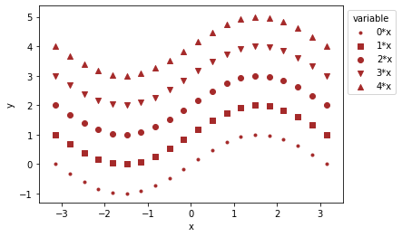
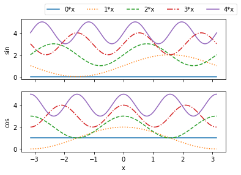

## Basic plots


```python
import numpy as np
import matplotlib.pyplot as plt
```

## Line plot

Let's plot a few sine functions with different line types; we assign a label to each trace, which can be displayed in a legend.


```python
x = np.linspace(-np.pi,np.pi, 200)

lts = ['-',':','--','-.','-']

for i in range(5):
    plt.plot(x, np.sin(i*x)+i,lts[i],label="{0}*x".format(i))
    
plt.ylabel("y")
plt.xlabel("x")
plt.legend(ncol=1,bbox_to_anchor=(1.0,1), title='variable')
plt.show()
```


## Scatter plot


```python
x = np.linspace(-np.pi,np.pi, 20)

marker = ["." , ",", "o", "v", "^"]
for i in range(5):
    plt.scatter(x, np.sin(x)+i, c = 'brown', marker=marker[i], label="{0}*x".format(i))
    
plt.ylabel("y")
plt.xlabel("x")
plt.legend(ncol=1,bbox_to_anchor=(1.0,1), title='variable')
plt.show()
```





## Subplots

To display multiple plots side-by-side, set up a subplot. Note the slightly different syntax for labels etc. 


```python
fig,ax=plt.subplots(2,1,sharex='col')

for i in range(5):
    ax[0].plot(x,np.sin(i*x)+i,lts[i],label="{0}*x".format(i))
    ax[1].plot(x,np.cos(i*x)+i,lts[i]                        )
    
ax[0].set_ylabel("sin")
ax[1].set_ylabel("cos")
ax[1].set_xlabel("x")
ax[0].legend(ncol=5,bbox_to_anchor=(0.1,1.02))
plt.show()
```





## Grammar of graphics with Pandas

An alternative is to create plots following _a grammar of graphics_, such as implemented in [plotly](https://plotly.com/python). Data should typically be prepared in long format [`Panda ` `DataFrame`s](https://pandas.pydata.org/).


```python
import pandas as pd

x = np.linspace(-np.pi,np.pi, 200)
mat = [np.sin(i*x.T) + i for i in range(5)]

# set column names to refer to them
columns = ['a','b','c','d','e']

d = pd.DataFrame(dict(zip(columns, mat)))
d['x'] = x
d.head()
```


<div>
<style scoped>
    .dataframe tbody tr th:only-of-type {
        vertical-align: middle;
    }

    .dataframe tbody tr th {
        vertical-align: top;
    }

    .dataframe thead th {
        text-align: right;
    }
</style>
<table border="1" class="dataframe">
  <thead>
    <tr style="text-align: right;">
      <th></th>
      <th>a</th>
      <th>b</th>
      <th>c</th>
      <th>d</th>
      <th>e</th>
      <th>x</th>
    </tr>
  </thead>
  <tbody>
    <tr>
      <th>0</th>
      <td>0.0</td>
      <td>1.000000</td>
      <td>2.000000</td>
      <td>3.000000</td>
      <td>4.000000</td>
      <td>-3.141593</td>
    </tr>
    <tr>
      <th>1</th>
      <td>0.0</td>
      <td>0.968431</td>
      <td>2.063106</td>
      <td>2.905420</td>
      <td>4.125960</td>
      <td>-3.110019</td>
    </tr>
    <tr>
      <th>2</th>
      <td>0.0</td>
      <td>0.936894</td>
      <td>2.125960</td>
      <td>2.811688</td>
      <td>4.249913</td>
      <td>-3.078445</td>
    </tr>
    <tr>
      <th>3</th>
      <td>0.0</td>
      <td>0.905420</td>
      <td>2.188312</td>
      <td>2.719645</td>
      <td>4.369885</td>
      <td>-3.046871</td>
    </tr>
    <tr>
      <th>4</th>
      <td>0.0</td>
      <td>0.874040</td>
      <td>2.249913</td>
      <td>2.630115</td>
      <td>4.483966</td>
      <td>-3.015297</td>
    </tr>
  </tbody>
</table>
</div>


Converting from this wide format to long format can be achieved with `melt`,


```python
m = pd.melt(d, id_vars='x')
m.head()          
```


<div>
<style scoped>
    .dataframe tbody tr th:only-of-type {
        vertical-align: middle;
    }

    .dataframe tbody tr th {
        vertical-align: top;
    }

    .dataframe thead th {
        text-align: right;
    }
</style>
<table border="1" class="dataframe">
  <thead>
    <tr style="text-align: right;">
      <th></th>
      <th>x</th>
      <th>variable</th>
      <th>value</th>
    </tr>
  </thead>
  <tbody>
    <tr>
      <th>0</th>
      <td>-3.141593</td>
      <td>a</td>
      <td>0.0</td>
    </tr>
    <tr>
      <th>1</th>
      <td>-3.110019</td>
      <td>a</td>
      <td>0.0</td>
    </tr>
    <tr>
      <th>2</th>
      <td>-3.078445</td>
      <td>a</td>
      <td>0.0</td>
    </tr>
    <tr>
      <th>3</th>
      <td>-3.046871</td>
      <td>a</td>
      <td>0.0</td>
    </tr>
    <tr>
      <th>4</th>
      <td>-3.015297</td>
      <td>a</td>
      <td>0.0</td>
    </tr>
  </tbody>
</table>
</div>


```python
import plotly.express as px
import plotly.graph_objects as go
import plotly.io as pio
pio.renderers
# pio.renderers.default = "browser"

fig = px.line(m, x='x', y='value', color='variable')
fig.show(renderer='png')

```


_Download this page [as a Jupyter notebook](https://github.com/vuw-scps/python-physics/raw/master/notebooks/plotting/basic.ipynb) or as a [standalone Python script](https://github.com/vuw-scps/python-physics/raw/master/scripts/plotting/basic.py)._
