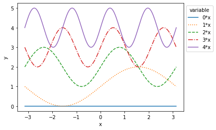

## Basic line plots


```python
import numpy as np
import matplotlib.pyplot as plt
```

## Single plot

Let's plot a few sine functions with different line types; we assign a label to each trace, which can be displayed in a legend.


```python
x = np.linspace(-np.pi,np.pi, 200)

lts = ['-',':','--','-.','-']

for i in range(5):
    plt.plot(x, np.sin(i*x)+i,lts[i],label="{0}*x".format(i))
    
plt.ylabel("y")
plt.xlabel("x")
plt.legend(ncol=1,bbox_to_anchor=(1.0,1), title='variable')
plt.show()
```





## Subplots

To display multiple plots side-by-side, set up a subplot. Note the slightly different syntax for labels etc. 


```python
fig,ax=plt.subplots(2,1,sharex='col')

for i in range(5):
    ax[0].plot(x,np.sin(i*x)+i,lts[i],label="{0}*x".format(i))
    ax[1].plot(x,np.cos(i*x)+i,lts[i]                        )
    
ax[0].set_ylabel("sin")
ax[1].set_ylabel("cos")
ax[1].set_xlabel("x")
ax[0].legend(ncol=5,bbox_to_anchor=(0.1,1.02))
plt.show()
```


## Grammar of graphics with Pandas

An alternative to this jovial menagerie of commands is to create plots following _a grammar of graphics_, such as implemented in [Seaborn](https://seaborn.pydata.org/). Data should be prepared in long format [`Panda ` `DataFrame`s](https://pandas.pydata.org/).


_Download this page [as a Jupyter notebook](https://github.com/vuw-scps/python-physics/raw/master/notebooks/plotting/line.ipynb) or as a [standalone Python script](https://github.com/vuw-scps/python-physics/raw/master/scripts/plotting/line.py)._
