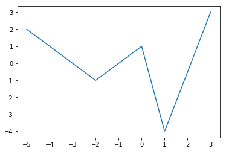
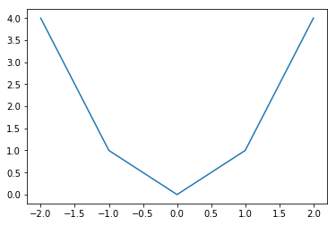
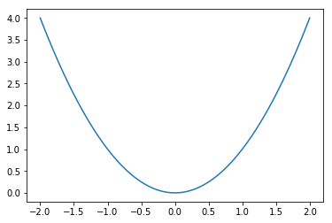
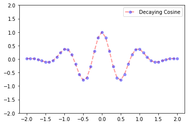
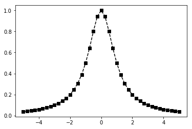
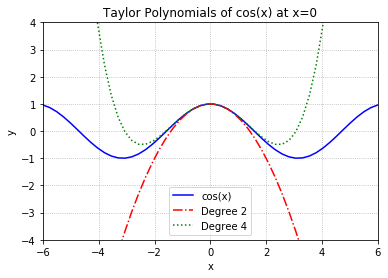
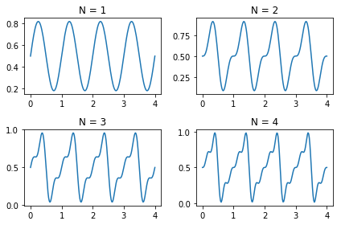
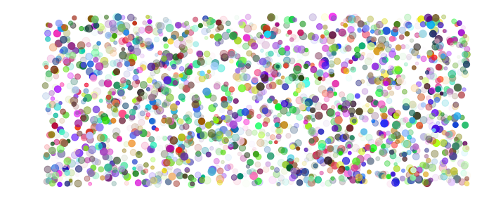
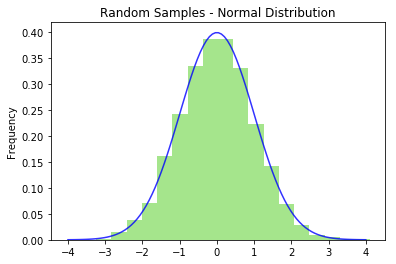
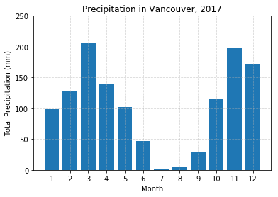

# Matplotlib

[Matplotlib](http://matplotlib.org) is a Python package for 2D plotting and the `matplotlib.pyplot` sub-module contains many plotting functions to create various kinds of plots. Let's get started by importing `matplotlib.pyplot` and using `%matplotlib` [Jupyter magic](https://ipython.readthedocs.io/en/stable/interactive/magics.html#magic-matplotlib) to display plots in the notebook.


```python
import numpy as np
import matplotlib.pyplot as plt
%matplotlib inline
```

## Basic Plotting

### Procedure

The general procedure to create a 2D line plot is:

1. Create a sequence of $x$ values.
2. Create a sequence of $y$ values.
3. Enter `plt.plot(x,y,[fmt],**kwargs)` where `[fmt]` is a (optional) format string and `**kwargs` are (optional) keyword arguments specifying line properties of the plot.
4. Use `pyplot` functions to add features to the figure such as a title, legend, grid lines, etc.
5. Enter `plt.show()` to display the resulting figure.

Let's begin with a basic example with a few random points:


```python
x = [-5,-2,0,1,3]
y = [2,-1,1,-4,3]
plt.plot(x,y)
plt.show()
```





The main things to notice are:

1. The sequences `x` and `y` define the coordinates of the points in the plot.
2. The line in the plot is constructed by connecting the points by straight lines.

The second observation implies that if we want to plot a smooth curve then we need to plot lots of points otherwise the plot will not be smooth. For example, we could try plotting the parabola $y = x^2$ for $x \in [-2,2]$ using only 5 points:


```python
x = [-2,-1,0,1,2]
y = [4,1,0,1,4]
plt.plot(x,y)
plt.show()
```





This is too few points to plot a smooth curve such as $y = x^2$ and so we need more points! Let's try again using the NumPy function `np.linspace` to create 100 points!


```python
x = np.linspace(-2,2,100)
y = x**2
plt.plot(x,y)
plt.show()
```





That's a better representation of the parabola $y = x^2$. Note that the number of points we use in a line plot (100 in this case) is completely arbitrary but the goal is to show a smooth graph for a smooth curve and so we just need to pick a big enough number depending on the function. But be careful not to generate too many points since a *very* large number of points will take a *long* time to plot!

Now that we have the general idea, let's look at adding style and features to our plots!

### Line Properties

A line appearing in a plot has several properties including color, transparency, style, width and markers. We can set these properties when we call `plt.plot` using the following keyword arguments:

| Property | Description |
| :---: | :--- |
| `alpha` | transparency (0.0 transparent through 1.0 opaque) |
| `color` (or `c`) | any matplotlib color |
| `label` | text appearing in legend |
| `linestyle` (or `ls`) | `solid`, `dashed`, `dashdot`, `dotted` |
| `linewidth` (or `lw`) | set width of the line |
| `marker` | set marker style |
| `markeredgecolor` (or `mec`) | any matplotlib color |
| `markerfacecolor` (or `mfc`) | any matplotlib color |
| `markersize` (or `ms`) | size of the marker |

Note that we can specify a [matplotlib color](https://matplotlib.org/api/colors_api.html) in several different ways including by name such as `blue` or `red`, or by a [RGB](https://www.w3schools.com/colors/colors_rgb.asp) tuple such as `(1,0,1)` for purple. For example, let's plot the function

$$
y = e^{-x^2}\cos(2 \pi x) \ \ , \ \ x \in [-2,2]
$$


```python
x = np.linspace(-2,2,41)
y = np.exp(-x**2) * np.cos(2*np.pi*x)
plt.plot(x,y,alpha=0.4,label='Decaying Cosine',
         color='red',linestyle='dashed',linewidth=2,
         marker='o',markersize=5,markerfacecolor='blue',
         markeredgecolor='blue')
plt.ylim([-2,2])
plt.legend()
plt.show()
```





Notice that we used the pyplot function `plt.legend` to display the figure with a legend (showing the line label) and  and `plt.ylim` to set the limits on the vertical axis to `[-2,2]`.

### Format Strings

A [format string](https://matplotlib.org/api/_as_gen/matplotlib.pyplot.plot.html#matplotlib-pyplot-plot) gives us a shortcut to add color, markers and line style to a line plot. For example, if we want to plot the function

$$
y = \frac{1}{1 + x^2} \ , \ x \in [-5,5]
$$

with a dashed black line and square markers, we could use keyword arguments:


```python
x = np.linspace(-5,5,41)
y = 1/(1 + x**2)
plt.plot(x,y,color='black',linestyle='dashed',marker='s')
plt.show()
```





Or we could use the corresponding format string `'ks--'` where `k` denotes a black line, `s` a square marker and `--` a dashed line:


```python
x = np.linspace(-5,5,41)
y = 1/(1 + x**2)
plt.plot(x,y,'ks--')
plt.show()
```


Much easier! See below for a list of colors, markers and linestyles.

#### Colors

| Character | Color |
| :---: | :---: |
| `b` | blue |
| `g` | green |
| `r` | red |
| `c` | cyan |
| `m` | magenta |
| `y` | yellow |
| `k` | black |
| `w` | white |

#### Markers

| Character | Marker |
| :---: | :---: |
| `.` | point |
| `o` | circle |
| `v` | triangle down |
| `^` | triangle up |
| `s` | square |
| `p` | pentagon |
| `*` |	star |
| `+` | plus |
| `x` |	x |
| `D` | diamond |

#### Line Styles

| Character | Line Style |
| :---: | :---: |
| `-` | solid line style |
| `--` | dashed line style |
| `-.` | dash-dot line style |
| `:` | dotted line style |

See the [matplotlib.pyplot.plot documentation](https://matplotlib.org/api/_as_gen/matplotlib.pyplot.plot.html) for more options.

### Pyplot Functions

There are many `pyplot` functions available for us to customize our figures. For example:

| Fucntion | Description |
| ---: | :--- |
| `plt.xlim` | set $x$ limits |
| `plt.ylim` | set $y$ limits |
| `plt.grid` | add grid lines |
| `plt.title` | add a title |
| `plt.xlabel` | add label to the horizontal axis |
| `plt.ylabel` | add label to the vertical axis |
| `plt.axis` | set axis properties (`equal`, `off`, `scaled`, etc.) |
| `plt.xticks` | set tick locations on the horizontal axis |
| `plt.yticks` | set tick locations on the vertical axis |
| `plt.legend` | display legend for several lines in the same figure |
| `plt.savefig` | save figure (as .png, .pdf, etc.) to working directory |
| `plt.figure` | create a new figure and set its properties |

See the [pyplot documentation](https://matplotlib.org/api/pyplot_summary.html) for a full list of functions.

## Examples

### Taylor Polynomials

Plot the function $y = \cos(x)$ along with its [Taylor polynomials](https://en.wikipedia.org/wiki/Taylor_series) of degrees 2 and 4.


```python
x = np.linspace(-6,6,50)

# Plot y = cos(x)
y = np.cos(x)
plt.plot(x,y,'b',label='cos(x)')

# Plot degree 2 Taylor polynomial
y2 = 1 - x**2/2
plt.plot(x,y2,'r-.',label='Degree 2')

# Plot degree 4 Taylor polynomial
y4 = 1 - x**2/2 + x**4/24
plt.plot(x,y4,'g:',label='Degree 4')

# Add features to our figure
plt.legend()
plt.grid(True,linestyle=':')
plt.xlim([-6,6])
plt.ylim([-4,4])
plt.title('Taylor Polynomials of cos(x) at x=0')
plt.xlabel('x')
plt.ylabel('y')

plt.show()
```





### Heart Curve

Plot the heart curve:

\begin{align}
x &= 16 \sin^3(t) \\\
y &= 13 \cos(t) - 5 \cos(2t) - 2 \cos(3t) - \cos(4t)
\end{align}

for $t \in [0,2\pi]$.


```python
t = np.linspace(0,2*np.pi,100)

x = 16*np.sin(t)**3
y = 13*np.cos(t) - 5*np.cos(2*t) - 2*np.cos(3*t) - np.cos(4*t)

# Plot line with RGB tuple (red=1, green=0.2, blue=0.5)
# and 20pt line width
plt.plot(x,y,c=(1,0.2,0.5),lw=20)

# Add features to our figure
plt.title('Heart!')
plt.axis('equal')
plt.axis('off')

plt.show()
```


## Subplots

The `plt.subplot` function takes at least 3 inputs $n$, $m$ and $i$ and creates a figure with a $n$ by $m$ grid of subplots and then sets the $i$th subplot (counting across the rows) as the current plot (ie. current axes object).

For example, consider the [sawtooth wave](https://en.wikipedia.org/wiki/Sawtooth_wave)

$$
f(t) = \frac{1}{2} - \frac{1}{\pi} \sum_{k=1}^{\infty} (-1)^k \frac{\sin(2 \pi k t)}{k}
$$

and let $f_N(t)$ denote the $N$th partial sum of the sawtooth wave:

$$
f_N(t) = \frac{1}{2} - \frac{1}{\pi} \sum_{k=1}^{N} (-1)^k \frac{\sin(2 \pi k t)}{k}
$$

Create a 2 by 2 grid of subplots to plot the first 4 partial sums:

\begin{align}
f_1(t) &= \frac{1}{2} + \frac{\sin(2 \pi t)}{\pi} \\\
f_2(t) &= \frac{1}{2} + \frac{\sin(2 \pi t)}{\pi} - \frac{\sin(4 \pi t)}{2\pi} \\\
f_3(t) &= \frac{1}{2} + \frac{\sin(2 \pi t)}{\pi} - \frac{\sin(4 \pi t)}{2\pi} + \frac{\sin(6 \pi t)}{3\pi} \\\
f_4(t) &= \frac{1}{2} + \frac{\sin(2 \pi t)}{\pi} - \frac{\sin(4 \pi t)}{2\pi} + \frac{\sin(6 \pi t)}{3\pi} - \frac{\sin(8 \pi t)}{4\pi}
\end{align}


```python
t = np.linspace(0,4,200)

fN = 1/2
for N in [1,2,3,4]:
    fN = fN - (-1)**N * np.sin(2*N*np.pi*t)/(N*np.pi)
    plt.subplot(2,2,N)
    plt.plot(t,fN)
    plt.title('N = {}'.format(N))

plt.tight_layout()
plt.show()
```





See the [documentation](https://matplotlib.org/api/_as_gen/matplotlib.pyplot.subplot.html) for more about subplots.

## Beyond Line Plots

### Scatter plots

A [scatter plot](https://matplotlib.org/api/_as_gen/matplotlib.pyplot.scatter.html) has 4 dimensions: $x$ coordinate, $y$ coordinate, size and color. Let's make a random scatter plot:


```python
# Set the number of dots in the plot
N = 2000

# Create random x and y coordinates sampled uniformly from [0,1]
x = np.random.rand(N)
y = np.random.rand(N)

# Create random array sampled uniformly from [20,120]
# `size` array is used below to set the size of each dot
size = 100*np.random.rand(N) + 20

# Create random 4-tuples sampled uniformly from [0,1]
# `colors` array is used below to set the color
# (red,green,blue,alpha) of each dot
colors = np.random.rand(N,4)

# Create a figure of size 12 by 5 and create scatter plot
plt.figure(figsize=(12,5))
plt.scatter(x,y,c=colors,s=size)
plt.axis('off')
plt.show()
```





### Histograms

Generate an array of 10000 random numbers sampled from the normal distribution and create a [histogram](https://matplotlib.org/api/_as_gen/matplotlib.pyplot.hist.html). Let's also superimpose the normal distribution:

$$
y = \frac{1}{\sqrt{2\pi}} e^{-x^2/2}
$$


```python
samples = np.random.randn(10000)
plt.hist(samples,bins=20,density=True,alpha=0.5,color=(0.3,0.8,0.1))
plt.title('Random Samples - Normal Distribution')
plt.ylabel('Frequency')

x = np.linspace(-4,4,100)
y = 1/(2*np.pi)**0.5 * np.exp(-x**2/2)
plt.plot(x,y,'b',alpha=0.8)

plt.show()
```





### Bar plots

Plot the [total precipitation in Vancouver](https://vancouver.weatherstats.ca/charts/precipitation-monthly.html) by month as a [bar plot](https://matplotlib.org/api/_as_gen/matplotlib.pyplot.bar.html):


```python
month = range(1,13)
precipitation = [98.8,128.8,206.0,138.5,102.2,46.4,1.8,5.0,29.4,114.8,197.0,170.6]

plt.bar(month,precipitation)

plt.xticks(month)
plt.yticks(range(0,300,50))
plt.grid(True,alpha=0.5,linestyle='--')
plt.title('Precipitation in Vancouver, 2017')
plt.ylabel('Total Precipitation (mm)')
plt.xlabel('Month')

plt.show()
```





## Figure and Axes Objects

*Under construction*

## Exercises

1. Plot the following functions:
    1. $f(x) = \sqrt{|x|}$, $x \in [-9,9]$
    2. $f(x) = \sin(x) + \sin(2x)$, $x \in [0,4\pi]$
    3. $f(x) = \arctan(x)$, $x \in [-5,5]$
    4. $f(x) = 2x\ln|x|$, $x \not=0$, $f(0)=0$, $x \in [-1,1]$
    5. $f(x) = (x+2)(x+1)(x-1)(x-2)(x - 3)$, $x \in [-2,3]$
    6. $f(x) = e^{-x^2}$, $x \in [-2,2]$
2. Plot the [figure eight curve](https://en.wikipedia.org/wiki/Lemniscate_of_Gerono):

    \begin{align}
    x &= \sin(t) \\\
    y &= \sin(t) \cos(t)
    \end{align}
    
    for $t \in [0,2\pi]$.

3. Plot the [trefoil knot](https://en.wikipedia.org/wiki/Trefoil_knot):

    \begin{align}
    x &= \sin t + 2 \sin 2t \\\
    y &= \cos t - 2 \cos 2t
    \end{align}

    for $t \in [0,2\pi]$.
    
4. Plot the [butterfly curve](https://en.wikipedia.org/wiki/Butterfly_curve_%28transcendental%29):

    \begin{align}
    x &= \sin(t) \left( e^{\cos t } - 2 \cos(4t) - \sin^5(t/12) \right) \\\
    y &= \cos(t) \left( e^{\cos t } - 2 \cos(4t) - \sin^5(t/12) \right)
    \end{align}

    for $t \in [0,100]$.

5. Write a function called `parametric_plots` which takes input parameters `a` and `k` and plots the parametric equation

    \begin{align}
    x(t) &= 2 k \cos(t) - a \cos(k t) \\\
    y(t) &= 2 k \sin(t) - a \sin(k t)
    \end{align}
    
    for $t \in [0,2\pi]$. Include a title for each subplot to display the values for $a$ and $k$, and use `plt.axis('equal')` to display the curve properly.
